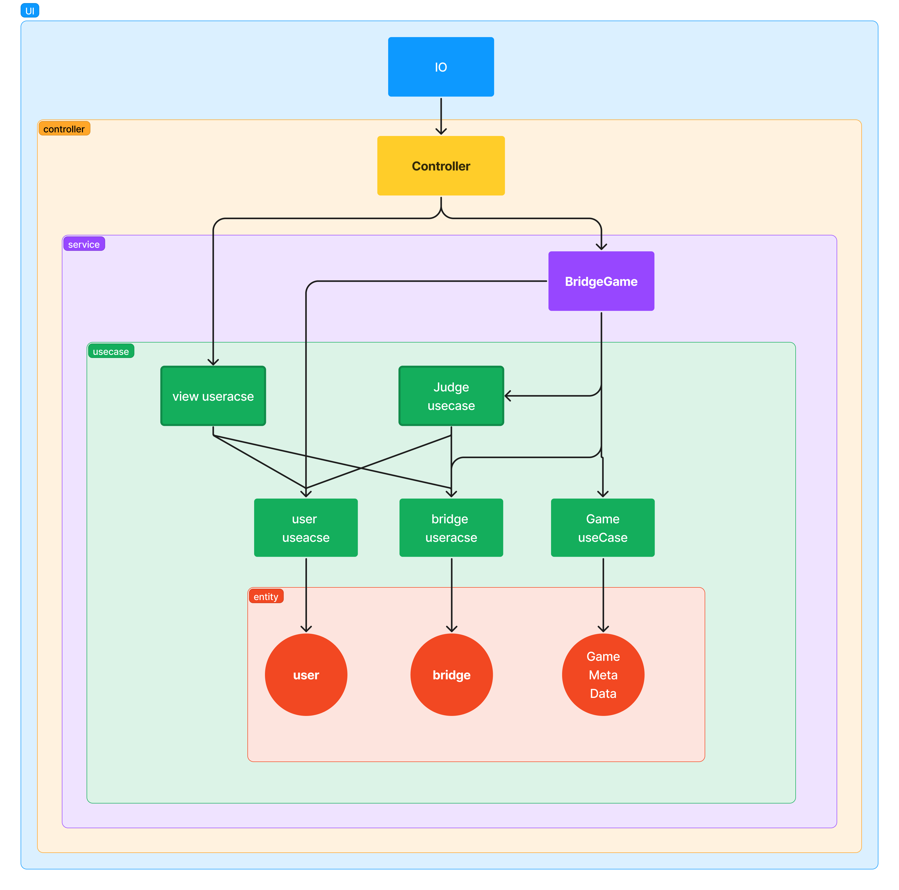

# 미션 - 다리 건너기

> 오징어게임에 나오는 사다리게임같은 게임입니다.  
> 몇번만에 다리를 건널 수 있을까요?!:)  
> 지금 즐겨보세요!  

## 시작하기

```bash
# 1. clone this 
git clone https://github.com/nerdchanii/javascript-bridge.git

# 2. install dependencies

npm install 

# 3. Run 

node src/App.js 

```

## 게임 설명

- 프로그램을 실행시키면 게임이 시작됩니다.
- 길이를 정해주면, 길이만큼 랜덤으로 정해진 건널 수 있는 다리를 만들어집니다.
- `U(UP)`와 `D(DOWN)`을 사용해 다음칸을 이동할 수 있어요!
- 실패 후, 다시 도전해 볼 수 있어요! 다시 도전을 원하시면 `R(RETRY)`을 종료를 원하시면 `Q(QUIT)`를 눌러 종료할 수 있어요!
- 몇 번만에 다리를 건널 수 있을까요?! 도전해보세요!👏🏻

## 프로젝트 설계

### **클린아키텍처를 적용한 이유**

클린아키텍처 구조를 적용해보려고 시도해보았습니다. 클린아키텍처를 활용하면 테스트가 더 용이할 수 있겠다고 생각했기 때문입니다. 테스트가 용이할 수록 프로그램의 신뢰성을 더 확보할 수 있고, 유지보수도 쉬워질 수 있을 것을 기대하고 시도해봤습니다.

### 다이어그램



```bash
src
├── App.js
├── BridgeMaker.js
├── BridgeRandomNumberGenerator.js
├── controller
│   └── Controller.js
├── domain
│   ├── constants.js
│   ├── entities
│   │   ├── Bridge.js
│   │   ├── GameMetaData.js
│   │   └── User.js
│   └── usecases
│       ├── BridgeInteractor.js
│       ├── GameInteractor.js
│       ├── JudgeInteractor.js
│       ├── UserInteractor.js
│       └── ViewInteractor.js
├── error
│   ├── BridgeError.js
│   ├── GameCommandError.js
│   ├── UserError.js
│   └── error.constants.js
├── infrastucture
│   └── io
│       └── Io.js
├── service
│   └── BridgeGame.js
├── utils
│   └── mapMarker.js
└── view
    ├── InputView.js
    ├── OutputView.js
    ├── Viewer.js
    └── view.constants.js

```

## 느낀점

- 코드를 작성하는건 생각보다 빠르게 작성할 수 있었습니다. 그러나 코드 작성의 어려움보다는 요구사항을 통해서 해결해야하는 문제들은 무엇인지 어떻게 접근하는게 좋은 방법일지 좋은 구조는 무엇일지 고민하는 시간이 더 컸습니다.
- 이런 고민들을 하면서 개발을 좀더 전체적인 시각에서 바라보게 된 것 같습니다. 비록 아주 작은 프로젝트이지만, 개발이라는 것 자체에 더 흥미를 느끼게 되는 시간이었습니다. 앞으로도  꾸준히 프리코스에서 배운 연습들을 실천할 수 있도록 노력하겠습니다 :smile:
