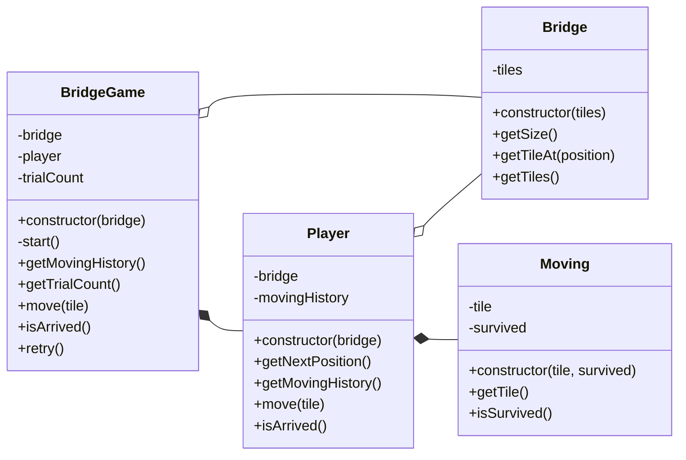

# javascript-bridge

## 📢3주차 공통 피드백

<details>
<summary>자세히 보기</summary>

### 함수(메서드) 라인에 대한 기준
프로그래밍 요구사항을 보면 함수 15라인으로 제안하는 요구사항이 있다. 이때 공백 라인도 한 라인에 해당한다. 15라인이 넘어간다면 함수 분리를 위한 고민을 한다.

### 발생할 수 있는 예외 상황에 대해 고민한다
정상적인 경우를 구현하는 것보다 예외 상황을 모두 고려해 프로그래밍하는 것이 더 어렵다. 예외 상황을 고려해 프로그래밍하는 습관을 들인다. 예를 들어 로또 미션의 경우 아래와 같은 예외 상황을 고민해 보고 해당 예외에 대해 처리를 할 수 있어야 한다.

* 로또 구입 금액에 1000 이하의 숫자를 입력
* 당첨 번호에 중복된 숫자를 입력
* 당첨번호에 1~45 범위를 벗어나는 숫자를 입력
* 당첨 번호와 중복된 보너스 번호를 입력

### 비즈니스 로직과 UI 로직을 분리한다
비즈니스 로직과 UI 로직을 한 클래스가 담당하지 않도록 한다. 단일 책임의 원칙에도 위배된다.

```js
class Lotto {
   #numbers
 
   // 로또 숫자가 포함되어 있는지 확인하는 비즈니스 로직
   contains(numbers) {
       ...
   }
 
   // UI 로직
   print() {
       ...
   }      
 
}
```

### 객체의 상태 접근을 제한한다
필드는 private class 필드로 구현한다. 객체의 상태를 외부에서 직접 접근하는 방식을 최소화 하는 이유에 대해서는 스스로 찾아본다.

```js
class WinningLotto {
   #lotto
   #bonusNumber
 
   constructor(lotto, bonusNumber) {
       this.#lotto = lotto
       this.#bonusNumber = bonusNumber
   }
}
```

### 객체는 객체스럽게 사용한다
Lotto 클래스는 numbers를 상태 값으로 가진다. 그런데 이 객체는 로직에 대한 구현은 하나도 없고, numbers에 대한 getter 메서드만을 가진다.

```js
class Lotto {
   #numbers
 
   constructor(numbers) {
       this.#numbers = numbers
   }
 
   getNumbers() {
       return this.#numbers
   }
}
 
class LottoGame {
   play() {
       const lotto = new Lotto(...)
 
       // 숫자가 포함되어 있는지 확인한다.
       lotto.getNumbers().contains(number)
 
       // 당첨 번호와 몇 개가 일치하는지 확인한다.
       lotto.getNumbers().stream()...
   }
}
```

Lotto에서 데이터를 꺼내지(get) 말고 메시지를 던지도록 구조를 바꿔 데이터를 가지는 객체가 일하도록 한다.

```js
class Lotto {
   #numbers
 
   constructor(numbers) {
       this.#numbers = numbers
   }
 
   contains(number) {
       // 숫자가 포함되어 있는지 확인한다.
       return ...
   }
 
   matchCount(other) {
       // 당첨 번호와 몇 개가 일치하는지 확인한다.
       return ...
   }
}
 
class LottoGame {
   play() {
       const lotto = new Lotto(...)
 
       lotto.contains(number)
       lotto.matchCount(...)
   }
}
```

(참고. [getter를 사용하는 대신 객체에 메시지를 보내자](https://tecoble.techcourse.co.kr/post/2020-04-28-ask-instead-of-getter/))

### 필드의 수를 줄이기 위해 노력한다
필드의 수가 많은 것은 객체의 복잡도를 높이고, 버그 발생 가능성을 높일 수 있다. 필드에 중복이 있거나, 불필요한 필드가 없는지 확인해 필드의 수를 최소화한다.
예를 들어 총 상금 및 수익률을 구하는 다음 객체를 보자.

```js
class LottoResult {
   #result = new Map()
   #profitRate
   #totalPrize
}
```

위 객체의 profitRate와 totalPrize는 등수 별 당첨 내역(result)만 있어도 모두 구할 수 있는 값이다. 따라서 위 객체는 다음과 같이 하나의 필드만으로 구현할 수 있다.

```js
class LottoResult {
   #result = new Map()
 
   calculateProfitRate() { ... }
 
   calculateTotalPrize() { ... }
}
```

### 성공하는 케이스 뿐만 아니라 예외에 대한 케이스도 테스트한다
테스트를 작성하면 성공하는 케이스에 대해서만 고민하는 경우가 있다. 하지만 예외에 대한 부분 또한 처리해야 한다. 특히 프로그램에서 결함이 자주 발생하는 부분 중 하나는 경계값이므로 이 부분을 꼼꼼하게 확인해야 한다.

```js
test("보너스 번호가 당첨 번호와 중복되는 경우에 대한 예외 처리", () => {
   mockQuestions( ["1000", "1,2,3,4,5,6", "6"]);
   expect(() => {
       const app = new App();
       app.play();
   }).toThrow("[ERROR]");
});
```

### 테스트 코드도 코드다
테스트 코드도 코드이므로 리팩터링을 통해 개선해나가야 한다. 특히 반복적으로 하는 부분을 중복되지 않게 만들어야 한다. 예를 들어 단순히 파라미터의 값만 바뀌는 경우라면 아래와 같이 테스트할 수 있다.

```js
test.each([["999"], ["0"], ["-123"]])("천원 미만의 금액에 대한 예외 처리", (input) => {
   expect((input) => {
     const app = new App(input);
     app.play();
   }).toThrow();
 }
);
```

### 테스트를 위한 코드는 구현 코드에서 분리되어야 한다
테스트를 위한 편의 메서드를 구현 코드에 구현하지 마라. 아래의 예시처럼 테스트를 통과하기 위해 구현 코드를 변경하거나 테스트에서만 사용되는 로직을 만들지 않는다.

* 테스트를 위해  # prefix를 바꾸는 경우
* 테스트 코드에서만 사용되는 메서드

### 단위 테스트하기 어려운 코드를 단위 테스트하기
아래 코드는 Random 때문에 Lotto에 대한 단위 테스트를 하기 힘들다. 단위 테스트가 가능하도록 리팩터링한다면 어떻게 하는 것이 좋을까?

```js
const MissionUtils = require("@woowacourse/mission-utils");
 
class Lotto {
   #numbers
 
   constructor() {
       this.#numbers = Randoms.pickUniqueNumbersInRange(1, 45, 6)
   }
}
---
class LottoMachine {
   execute() {
       const lotto = new Lotto()
   }
}
```

올바른 로또 번호가 생성되는 것을 테스트하기 어렵다. 테스트하기 어려운 것을 클래스 내부가 아닌 외부로 분리하는 시도를 해 본다.

```js
const MissionUtils = require("@woowacourse/mission-utils");
 
class Lotto {
   #numbers
 
   constructor(numbers) {
       this.#numbers = numbers
   }
}
 
class LottoMachine {
   execute() {
       const numbers = Randoms.pickUniqueNumbersInRange(1, 45, 6)
       const lotto = new Lotto(numbers)
   }
}
```

위 코드는 A 상황을 B로 바꾼 것이다. 


A.
```
Application(테스트하기 어려움)
     ⬇️
LottoMachine(테스트하기 어려움)
     ⬇️
Lotto(테스트하기 어려움) ➡️ Randoms(테스트하기 어려움)
```

B.
```
Application(테스트하기 어려움) 
     ⬇️
LottoMachine(테스트하기 어려움) ➡️ Randoms(테스트하기 어려움) 
     ⬇️
Lotto(테스트하기 쉬움)
```

(참고. [메서드 시그니처를 수정하여 테스트하기 좋은 메서드로 만들기](https://tecoble.techcourse.co.kr/post/2020-05-07-appropriate_method_for_test_by_parameter/))

이처럼 단위 테스트를 할 때 테스트하기 어려운 부분은 분리하고 테스트 가능한 부분을 단위 테스트한다. 테스트하기 어려운 부분은 단위 테스트하지 않아도 된다. 남은 LottoMachine은 어떻게 테스트하기 쉽게 바꿀 수 있을지 고민해 본다.

</details>


## 📃구현할 기능 목록

아래와 같은 형식으로 작성합니다.
```
* 기능 분류 (브랜치명)
  - 기능1
  - 기능2
  - ...
```

* 다리 기본 기능 (bridge-basic)
  - **다리**는 위, 아래 두 칸으로 이루어져 있어야 한다.
  - **다리**는 위, 아래 두 칸 중 하나의 칸만 건널 수 있어야 한다.
  - **다리**는 주어진 숫자만큼 길이를 가져야 한다.
  - **다리**의 **칸** 중 건널 수 있는 칸은 0과 1중 무작위로 정하되, 0은 아래 칸, 1은 위 칸이 된다.
  - 위 칸을 건널 수 있는 경우는 U, 아래 칸을 건널 수 있는 경우는 D로 나타내야 한다.

* 다리 건너기 기능 (bridge-move)
  - 사용자는 건널 **칸**을 선택하고 건널 수 있어야 한다.
  - 선택한 **칸**이 이동할 수 있으면 O, 이동할 수 없으면 X로 표시해야 한다.

* 게임 진행 규칙 기능 (gamerule)
  - **다리**를 끝까지 건너면 게임을 종료해야 한다.
  - **다리**를 건너다 실패하면 게임을 재시작하거나 종료할 수 있어야 한다.
  - 게임을 재시작하더라도 처음에 만든 **다리**를 재사용해야 한다.
  - 게임 종료 후 결과에서 총 시도한 횟수를 나타내야 한다.
    - 시도한 횟수는 첫 시도와 마지막 시도를 포함해야 한다.

* 프로그램 입출력 기능 (io)
  - 입력할 수 없는 값 이외에 다른 값을 입력한 경우 예외를 발생시키고 에러 메세지를 출력한 후 그 부분부터 다시 시작되어야 한다.
  - **다리**의 길이는 3이상 20이하의 숫자만 입력할 수 있어야 한다.
  - 라운드마다 이동할 수 있는 **칸** U, D 중 하나를 입력받을 수 있어야 한다.
  - 게임 도중 실패 시 **재시작 또는 종료 여부**인 R, Q를 입력받을 수 있어야 한다.
  - 게임을 시작한 직후 "다리 건너기 게임을 시작합니다." 메세지를 출력해야 한다.
  - 게임이 종료된 후 게임 성공 여부와 총 시도한 횟수를 출력해야 한다.
  - 사용자가 이동할 때마다 다리 건너기 결과를 출력해야 한다.
  - 모든 예외는 "[ERROR]" 로 시작해야 한다.

## ✒디렉토리 및 파일 설계

```
📦src
 ┣ 📂domains
 ┃ ┣ 📜Bridge.js  --- 다리를 정의한 클래스
 ┃ ┣ 📜BridgeGame.js  --- 다리 건너기 게임을 정의한 클래스
 ┃ ┣ 📜Moving.js  --- 플레이어의 이동 흔적을 정의한 클래스
 ┃ ┗ 📜Player.js  --- 플레이어를 정의한 클래스
 ┣ 📂errors
 ┃ ┣ 📜AppError.js  --- 프로그램 내에서 발생할 수 있는 모든 에러
 ┃ ┣ 📜BridgeError.js  --- 다리와 관련된 로직에서 발생한 에러
 ┃ ┗ 📜ValidationError.js  --- 값 검증 중 발생한 에러
 ┣ 📂intl
 ┃ ┗ 📜Messages.js  --- 프로그램에서 사용되는 모든 메세지
 ┣ 📂utils
 ┃ ┣ 📜deepFreeze.js  --- Object.freeze의 nested 버전
 ┃ ┗ 📜Routine.js  --- 콜백 기반의 비동기 함수를 제너레이터 문법을 이용하여 async/await처럼 사용하게 해주는 유틸
 ┣ 📂validators
 ┃ ┣ 📜index.js  --- 각종 입력(다리 길이, 게임 재시작 또는 종료 등)에 대한 검증 함수들 정의
 ┃ ┣ 📜ArrayValidator.js  --- 배열 값의 검증을 수행
 ┃ ┣ 📜NumberValidator.js  --- 숫자 값의 검증을 수행
 ┃ ┣ 📜StringValidator.js  --- 문자열 값의 검증을 수행
 ┃ ┗ 📜Validator.js  --- 타입이 특별히 지정되지 않은 값의 검증을 수행
 ┣ 📂views
 ┃ ┣ 📜InputView.js  --- 입력에 대한 뷰
 ┃ ┗ 📜OutputView.js  --- 출력에 대한 뷰
 ┣ 📜App.js  --- 도메인, 뷰들을 사용하여 프로그램 기능 수행
 ┣ 📜BridgeMaker.js  --- 다리에 사용되는 타일들을 생성
 ┣ 📜BridgeRandomNumberGenerator.js  --- 0, 1 숫자를 랜덤으로 생성
 ┗ 📜constants.js  --- 프로그램에서 사용되는 상수들 정의
```

## 📋클래스 다이어그램



## 🎨코드 스타일

- <details>
    <summary>eslint 사용</summary>

    `npm install --save-dev eslint` 로 설치하고 .eslintrc.js 파일을 생성하여 코드 스타일을 정의한다.
  </details>

- <details>
    <summary>prettier 사용</summary>

    `npm install --save-dev prettier` 로 설치한다.

    .prettierrc 파일을 생성한 후 prettier 규칙을 추가한다.
  </details>

- <details>
    <summary>airbnb 규칙 사용</summary>

    `npx install-peerdeps --dev eslint-config-airbnb` 명령으로 설치한다.

    .eslintrc.js의 `extends: [...]` 에 `'airbnb'` 를 추가한다.
  </details>

- <details>
    <summary>우아한테크코스 규칙 사용</summary>

    * 프로그램 종료 시 process.exit()를 호출하지 않는다.
    ```js
    rules: {
      'no-process-exit': 'error',
    }
    ```

    * indent(인덴트, 들여쓰기) depth를 3이 넘지 않도록 구현한다. 2까지만 허용한다.
    ```js
    rules: {
      'max-depth': ['error', 2],
    }
    ```

    * 함수(또는 메서드)의 길이가 15라인을 넘어가지 않도록 구현한다.
    ```js
    rules: {
      'max-lines-per-function': ['error', 15],
    }
    ```

    * 메서드의 파라미터 개수는 최대 3개까지만 허용한다.
    ```js
    rules: {
      'max-params': ['error', 3],
    }
    ```
  </details>

- <details>
    <summary>JSDoc 작성</summary>

    클래스, 함수, 변수의 문서화 및 타입을 명확히 하기 위해 JSDoc을 작성한다.

    ```js
    /**
     * 공백을 횟수만큼 늘려주는 함수
     *
     * @param {number} count
     * @returns {string}
     */
    function blank(count) {
      return Array(count).fill(' ').join('');
    }
    ```

    JSDoc의 eslint 지원을 위해 `npm install --save-dev eslint-plugin-jsdoc` 명령으로 플러그인을 설치한다.

    설치 후, .eslintrc.js의 `extends: [...]` 에 `'plugin:jsdoc/recommended'` 를 추가한다.
  </details>

- <details>
    <summary>테스트 폴더 일부 규칙 비활성화</summary>

    테스트 폴더에서는 일부 규칙들을 비활성화하도록 한다.

    ```js
    overrides: [
      {
        files: ['__tests__/**/*.js'],
        rules: {
          'max-lines-per-function': 'off',
          'no-new': 'off',
        },
      },
    ],
    ```
  </details>

## 테스트 커버리지

jest 의 커버리지 기능을 사용하였습니다.

```
npx jest --coverage
```

<details>
<summary>자세히 보기</summary>

```
---------------------------------|---------|----------|---------|---------|-------------------
File                             | % Stmts | % Branch | % Funcs | % Lines | Uncovered Line #s 
---------------------------------|---------|----------|---------|---------|-------------------
All files                        |      98 |    87.32 |   97.46 |   98.31 |                   
 src                             |     100 |      100 |     100 |     100 |                   
  App.js                         |     100 |      100 |     100 |     100 |                   
  BridgeMaker.js                 |     100 |      100 |     100 |     100 |                   
  BridgeRandomNumberGenerator.js |     100 |      100 |     100 |     100 | 
  constants.js                   |     100 |      100 |     100 |     100 | 
 src/domains                     |     100 |      100 |     100 |     100 | 
  Bridge.js                      |     100 |      100 |     100 |     100 | 
  BridgeGame.js                  |     100 |      100 |     100 |     100 | 
  Moving.js                      |     100 |      100 |     100 |     100 | 
  Player.js                      |     100 |      100 |     100 |     100 | 
 src/errors                      |     100 |      100 |     100 |     100 | 
  AppError.js                    |     100 |      100 |     100 |     100 | 
  BridgeError.js                 |     100 |      100 |     100 |     100 | 
  ValidationError.js             |     100 |      100 |     100 |     100 | 
 src/intl                        |     100 |      100 |     100 |     100 | 
  Messages.js                    |     100 |      100 |     100 |     100 | 
 src/utils                       |   96.77 |    91.66 |     100 |     100 | 
  Routine.js                     |   96.15 |     87.5 |     100 |     100 | 69
  deepFreeze.js                  |     100 |      100 |     100 |     100 | 
 src/validators                  |   94.82 |    83.72 |      92 |   94.54 |
  ArrayValidator.js              |     100 |      100 |     100 |     100 |
  NumberValidator.js             |      90 |    82.35 |      75 |      90 | 48
  StringValidator.js             |     100 |      100 |     100 |     100 |
  Validator.js                   |   94.44 |    76.47 |     100 |   93.75 | 30
  index.js                       |    92.3 |      100 |   85.71 |   91.66 | 18
 src/views                       |   98.07 |       90 |     100 |      98 |
  InputView.js                   |   96.29 |       75 |     100 |   96.29 | 41
  OutputView.js                  |     100 |      100 |     100 |     100 |
---------------------------------|---------|----------|---------|---------|-------------------
```

</details>
