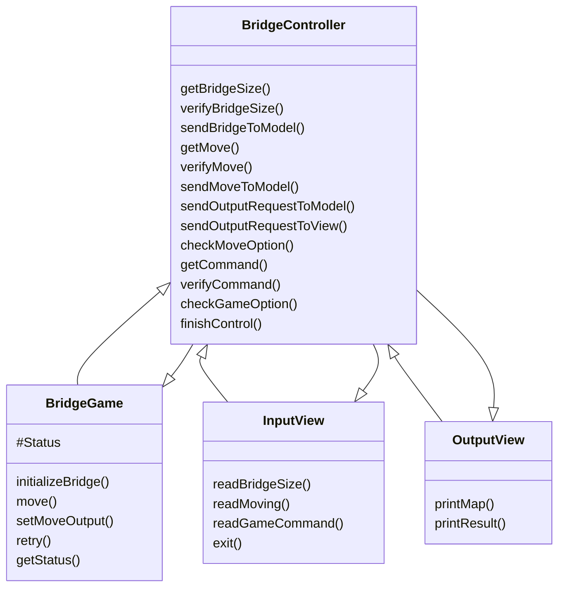
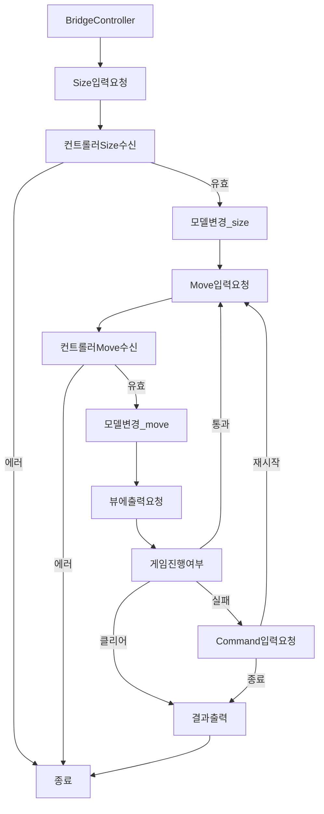

# 기능 목록

## 1. `InputView`의 `readBridgeSize()`를 통해 다리의 길이를 입력받는 기능 구현

- 값이 유효한지 확인한다. 유효하지 않다면 isError = true
- `BridgeController`에서 `readBridgeSize()`를 호출하여 입력값을 받아오고, `BridgeGame`으로 넘겨서 모델의 변경을 요청한다.

## 2. `BridgeMaker`의 `makeBridge()`를 통해 다리를 생성하는 기능 구현

- `BridgeRandomNumberGenerator`의 랜덤값 생성을 통하여 구현한다
- `BridgeGame`에서 `BridgeController`에서 전달된 size를 통해 bridge 생성 후 `#Status` 객체 내부에 저장

## 3. `InputView`의 `readMoving()`을 통해 이동 입력을 받는 기능 구현

- 값이 유효한지 확인한다. 유효하지 않다면 isError = true
- `BridgeController`에서 `readMoving()`을 호출하여 입력값을 받아오고, `BridgeGame`으로 넘겨서 모델의 변경을 요청한다.

## 4. 입력받은 이동 입력을 바탕으로 생성된 Bridge의 값과 일치하는지 비교하는 기능 구현

- `BridgeController`에서 `BridgeGame`의 `#Status`를 불러와 통과, 클리어 여부를 확인하고 게임을 진행시킨다.

## 5. 이동 결과를 계산하는 기능 구현

## 6. `OutputView`의 `printMap()`을 통해 이동한 결과값을 출력하는 기능 구현

- `BridgeController`에서 `BridgeGame`의 `#Status`를 불러와 뷰에 생성된 Output 출력 요청

## 7. 이동 실패 시 재시작하는 기능 구현

- 값이 유효한지 확인한다. 유효하지 않다면 isError = true
- `BridgeController`에서 `readGameCommand()`를 호출하여 입력값을 받아오고, `BridgeGame`으로 넘겨서 모델의 변경을 요청한다.
- 유효하다면 다리를 재생성하지 않고 게임을 재시작한다.

## 8. 게임 성공 여부, 총 시도횟수를 출력하는 기능 구현

## 리팩토링

- 하드코딩된 부분들을 `Constants` 폴더에 상수 파일들을 생성하여 분리.
- 비구조화할당 되어있지 않던 함수들을 비구조화 할당.
- 유효성 검사 함수들을 `Utils/Validation.js`로 분리 예정
- MVC 디자인 패턴을 적용하여 Model(`BridgeGame`), Controller(`BridgeController`), View(`InputView`, `OutputView`) 분리

## Validation.js에서 검사해야하는 항목들

1.  `readBridgeSize()`

- 다리 길이를 입력 받을 때 숫자가 맞는지

2.  `readMoving()`

- 이동할 칸을 입력받을 때 문자가 맞는지 (1자리)
- 입력받은 문자가 U 또는 D가 맞는지

3. `readGameCommand()`

- 이동할 칸을 입력 받을 때 문자가 맞는지 (1자리)
- 입력받은 문자가 R 또는 Q가 맞는지

## 미구현된 항목

- (`22. 11. 20.) Jest 테스트 파일 구현 필요

# 기능 흐름

## 기능 다이어그램

- 유틸함수는 포함하지 않았습니다.

## 기능 플로우차트

