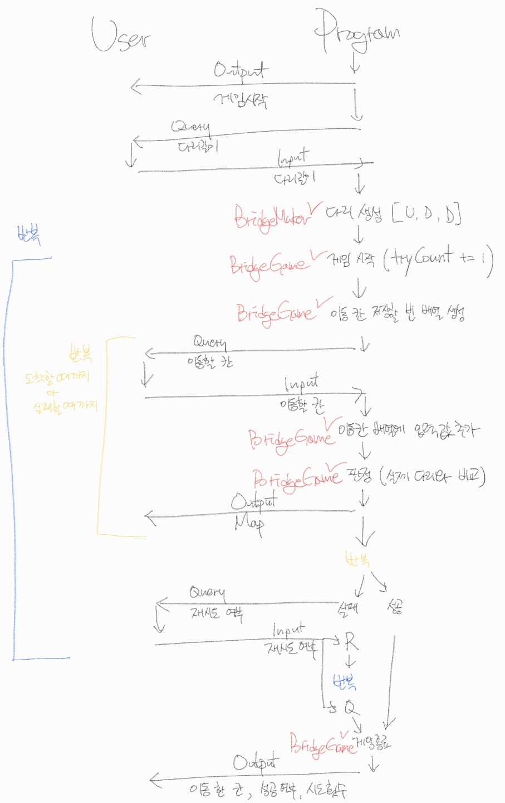

# 클래스(객체) 요구 사항
- `InputView` 객체
  - 파일 경로 변경 가능
  - 여기서만 readLine 사용 가능
  - 메서드 인자 변경 가능
  - 메서드 추가 가능
  - `readBridgeSize`: 다리길이 입력
  - `readMoving`: 이동할 칸 입력
  - `readGameCommand`: 재시도or종료 입력
- `OutputView` 객체
  - 파일 경로 변경 가능
  - 메서드 이름 변경 불가능
  - 메서드 인자 변경 가능
  - 메서드 추가 가능
  - `printMap`: 현재까지 이동한 다리 상태 정해진 형식에 맞게 출력
  - `printResult`: 게임의 최종 결과
- `BridgeGame` 클래스
  - 필드(인스턴스 변수) 추가 가능
  - 파일 경로 변경 가능
  - 메서드 이름 변경 불가능
  - 메서드 인자 변경 가능
  - 메서드 추가 가능
  - `move`: 칸 이동
  - `retry`: 게임 재시도
- `BridgeMaker` 객체
  - 프로퍼티 추가 불가능
  - 파일 경로 변경 불가능
  - 메서드의 시그니처(인자, 이름)와 반환 타입 변경 불가능
  - `makeBridge`: 다리 생성
- `BridgeRandomNumberGenerator` 객체
  - 코드 변경 불가능

## Flow

# 1. 하드코딩
- [x] ApplicationTest 만을 만족하기 위한 하드코딩
- [ ] 목표: 하드코딩 이후 최종 코드 완성까지 ApplicationTest를 항상 만족하기

# 2. 정상 동작하도록 코딩
## 구현할 기능 목록
- [x] 입력받은 길이의 다리 생성
  - 0과 1 중 랜덤 값을 이용해서 건널 수 있는 칸을 정함
    - 0이면 -> D(아래)
    - 1이면 -> U(위)
- [ ] 게임 시도
  - [ ] 시도 횟수 카운팅
- [ ] 이동
  - [ ] 실제 사용자가 이동한 칸 기록
  - [ ] 플레이어가 이동한 칸 판정
- [ ] 게임 종료
- [ ] UI
  - [x] 자동으로 생성할 다리 길이 입력
    - 3 이상 20 이하의 숫자만 입력 가능. 올바른 값이 아니면 예외 처리
  - [ ] 라운드마다 플레이어가 이동할 칸 입력
    - U(위) or D(아래) 중 하나의 문자 입력 가능. 올바른 값 아니면 예외 처리
  - [ ] 처음부터 현재까지 이동한 칸 전체 출력
  - [ ] 게임 재시작/종료 여부 입력
    - R(재시작) or Q(종료) 중 하나의 문자 입력 가능. 올바른 값 아니면 예외 처리
  - [ ] 최종 게임 결과 출력

## 목록 기준 단위 기능 구현, 단위 테스트

# 3. 리팩토링
## 구현할 기능 목록
## 목록 기준 단위 기능 구현, 단위 테스트