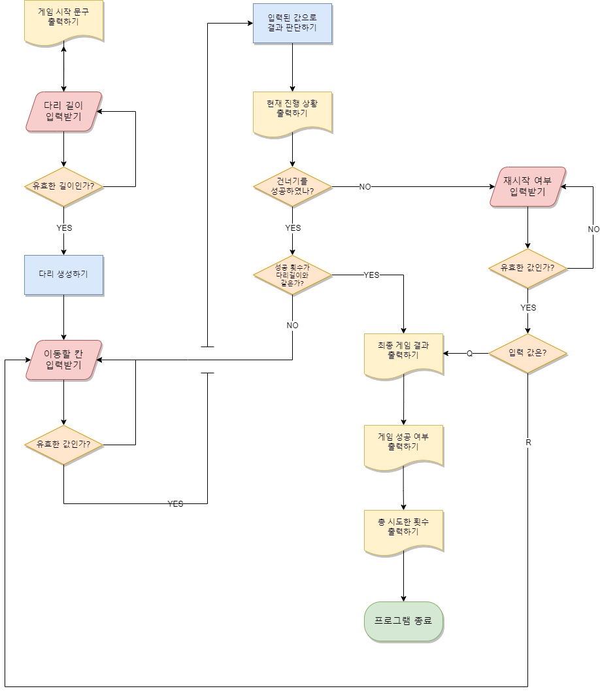

## ✍구현 기능 목록

- [x] **게임 시작 문구 출력하기**
  - [x] `다리 건너기 게임을 시작합니다.` 출력
- [x] **다리 길이 입력 받기**
- [x] **다리 길이 유효성 검사**
  - [x] 입력 값이 1~20 사이의 숫자인가?
  - [x] 입력 값이 소수인가?
- [x] **다리 생성하기**
  - [x] `BridgeRandomNumberGenerator`를 사용해 생성된 값이 0이면 아래칸, 1이면 윗칸을 건널수 있는 칸으로 설정
  - [x] 입력된 다리 길이만큼 반복
- [x] **이동할 칸 입력받기**
  - [x] `이동할 칸을 선택해주세요. (위: U, 아래: D)` 출력
  - [x] 소문자일시 대문자로 변경
- [x] **이동할 칸 유효성 검사**
  - [x] 입력값이 `U`나 `D`인가?
- [x] **입력된 값으로 결과 판단하기**
- [x] **현재 진행상황 출력하기**
- [x] **진행 성공시 성공 횟수와 다리 길이를 비교해서 게임 클리어 판단**
  - [x] 다리 길이보다 성공 횟수가 적을시 이동할 칸 입력부터 재실행
  - [x] 다리 길이와 성공 횟수가 같을시 게임 종료 로직 실행
    - [x] 최종 게임 결과 출력
    - [x] `게임 성공 여부: 성공` 출력
    - [x] `총 시도한 횟수` 출력
- [x] **진행 실패시 게임 재시작 여부 입력받기**
  - [x] 최종 게임 결과 출력
  - [x] `게임 성공 여부: 실패` 출력
  - [x] 재시작 여부 입력받기
  - [x] 재시작 여부 유효성검사
    - [x] 입력값이 `R`이나 `Q`인가?
  - [x] 입력 값이 `R`일시 이동할 칸 입력받기부터 재시작
  - [x] 입력 값이 `Q`일시 게임 종료 로직 실행
    - [x] 최종 게임 결과 출력
    - [x] `게임 성공 여부: 실패` 출력
    - [x] `총 시도한 횟수` 출력

## 🖥기능 로직

