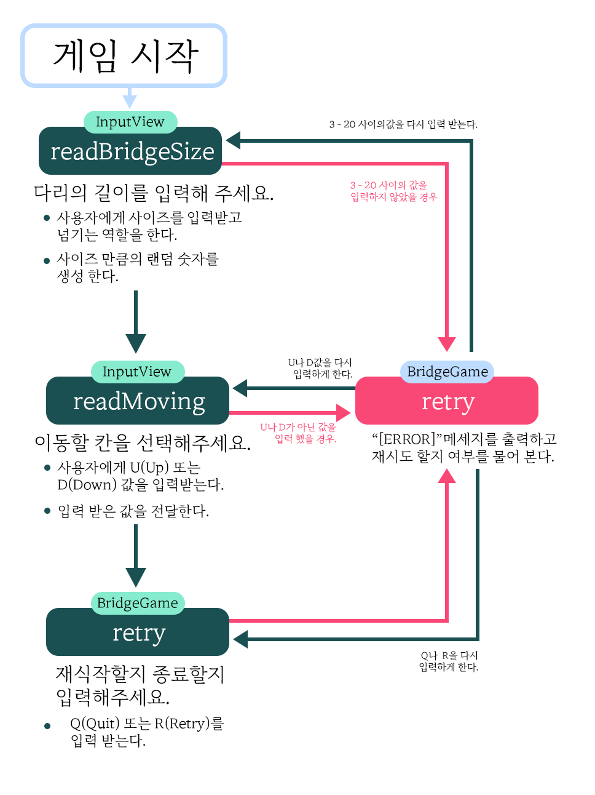
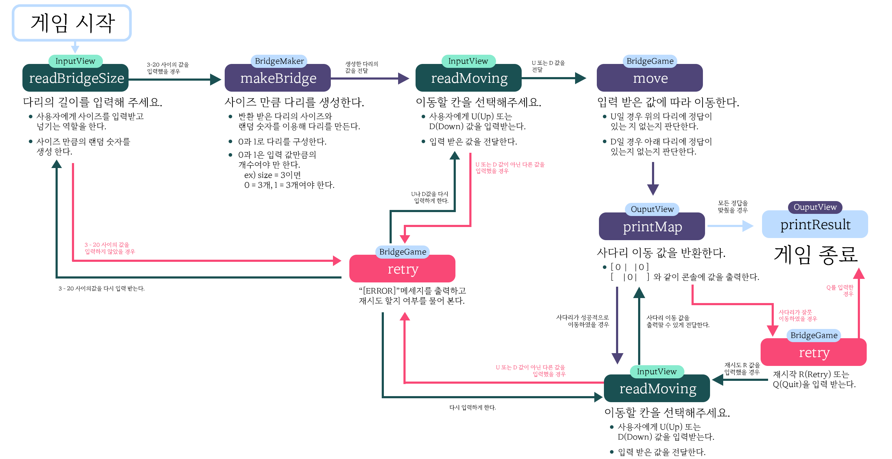

# 사다리 게임

---

## 기능 요구사항

> 사용자의 요구사항

    게임을 클리어하고 싶다

> 기능 리스트

    1.사용자가 입력한 값 만큼의 사다리가 생성되어야 한다.
    2.사용자가 입력한 U(Up)과 D(Down)에 맞춰 사다리를 이동할 수 있어야 한다.
    3.사다리를 이동하면서 발생하는 올바른 결과 을을 출력해야 한다.
    4.사용자가 정답을 맞추지 못하였을 경우
      -사다리에 X 표시를 출력해 사용자가 입력한 값이 틀렸음을 알 수 있게 해야 한다.
      -적절한 예외 값을 출력하고 사용자가 게임을 다시 시작할지 끝낼지의 여부를 물어봐야 한다.
      -사용자가  R(Retry)를 입력하였을 경우 생성된 사다리는 유지 한 상태로 처음부터 다시 U(Up)이나 D(Down)을 입력할 수 있게 해야 한다.
      -사용자가 Q(Quit)을 입력하였을 경우 사용자가 몇번의 시도를 했는지 사다리의 어느 위치에서 틀렸는지 그리고 사용자가 게임을 클리어하지
      못했다는 것을 알 수 있게 출력해야한다.
    5.사용자가 정답을 맞췄을 경우
      -사다리에 O를 표시하여 사용자가 입력한 값이 맞았음을 알 수 있게 해야 한다.
      -사용자가 다시 U(Up)이나 D(Down)을 다시 입력할 수 있게 해야 한다.
    6.사용자가 모든 정답을 맞췄을 경우
      -몇번의 시도를 했는지와 사다리의 어느 위치가 정답인지 알 수 있게하고 정답인지 틀렸는지를 알 수 있게끔 결과값을 출력한다.

---

## 예외 사항

1.사용자가 사다리의 길이를 정할 때 3~20 사이의 숫자 이외의 값을 입력하였을 경우  
2.플레이어가 이동할 칸을 입력할 때 사용자가 U(Up)이나 D(Down)이외의 값을 입력하였을 경우  
3.사용자가 정답을 맞추지 못하였을 경우나 모든 정답을 맞추었을 경우 다시 시작할지 끝낼지에 대해서 물었을 때 R(Retry)나 Q(Quit) 값 이외의 값을 입력하였을 경우

> **예외 값을 반환 하는 경우 콘솔을 종료 시키는 것이 아닌 예외 상황을 발생시킨 부분으로 돌아가서 값을 다시 입력한다!**

---

## 메인 로직

---

## 기능 리스트

