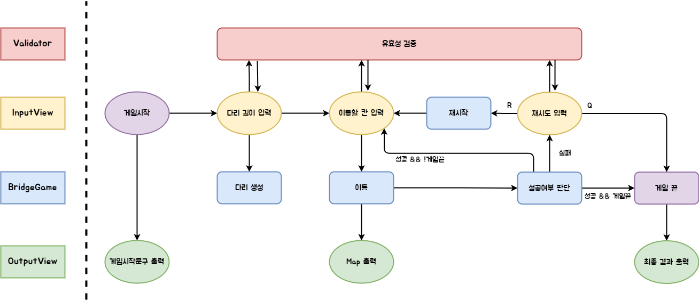

# Week4: Bridge Game

# 🎯기능 구현 목록

## 🥇BridgeGame

- [ ] 다리를 생성하는 기능
  - [ ] 랜덤으로 숫자를 1개 생성하는 기능 (BridgeRandomNumberGenerator)
  - [ ] 받은 숫자만큼 다리를 생성하는 기능(BridgeMaker)
- [ ] 이동하는 기능
- [ ] 이동후 결과를 판단하는 기능
  - [ ] 성공 && 끝까지 도달
  - [ ] 성공 && 끝까지 도달하지 않음
  - [ ] 실패

## 🥇 Validator

- [ ] 다리 길이 입력 검증
  - [ ] 숫자가 아닌 경우
  - [ ] 3이상 20 이하가 아닌경우
- [ ] 이동할 칸 입력 검증
  - [ ] 'U'이나 'D'가 아닐 경우
- [ ] 재시도 여부 입력 검증
  - [ ] 'R'이나 'Q'가 아닐 경우

## 🥇InputView

- [x] 다리 길이를 입력받는 기능
- [ ] 이동할 칸을 입력받는 기능
- [ ] 재시도 여부를 입력받는 기능

## 🥇OutputView

- [x] 게임시작 문구를 출력하는 기능
- [ ] Bridge Map을 출력하는 기능
- [ ] 최종 결과를 출력하는 기능
