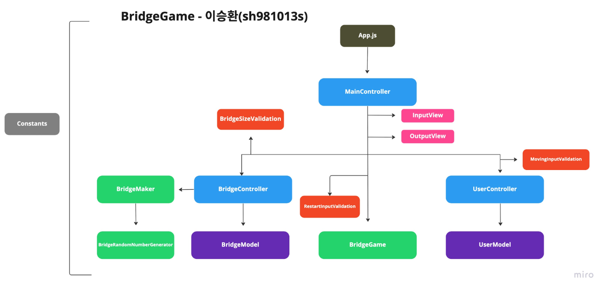

# 🚀 다리 건너기 게임 기능 구현 문서

## 🙋🏻‍♂️작성자

- 이승환(sh981013s)

## 🛠 구조



```markdown
🗳__tests__
 ┣ 📜ApplicationTest.js
 ┣ 📜BridgeMakerTest.js
 ┣ 📜BridgeTest.js
 ┗ 📜UserTest.js
🗳src
 ┣ 📂constants
 ┃ ┣ 📜GeneralConstants.js
 ┃ ┗ 📜Messages.js
 ┣ 📂controller
 ┃ ┣ 📜BridgeController.js
 ┃ ┣ 📜BridgeGame.js
 ┃ ┣ 📜MainController.js
 ┃ ┗ 📜UserController.js
 ┣ 📂model
 ┃ ┣ 📜BridgeModel.js
 ┃ ┗ 📜UserModel.js
 ┣ 📂validation
 ┃ ┣ 📜BridgeSizeValidation.js
 ┃ ┣ 📜MovingInputValidation.js
 ┃ ┗ 📜RestartInputValidation.js
 ┣ 📜App.js
 ┣ 📜BridgeMaker.js
 ┗ 📜BridgeRandomNumberGenerator.js
```

## 🧾 기능 요구사항

```markdown
- 위아래 두 칸으로 이루어진 다리를 건너야 한다.
    - 다리는 왼쪽에서 오른쪽으로 건너야 한다.
    - 위아래 둘 중 하나의 칸만 건널 수 있다.
- 다리의 길이를 숫자로 입력받고 생성한다.
    - 다리를 생성할 때 위 칸과 아래 칸 중 건널 수 있는 칸은 0과 1 중 무작위 값을 이용해서 정한다.
    - 위 칸을 건널 수 있는 경우 U, 아래 칸을 건널 수 있는 경우 D값으로 나타낸다.
    - 무작위 값이 0인 경우 아래 칸, 1인 경우 위 칸이 건널 수 있는 칸이 된다.
- 다리가 생성되면 플레이어가 이동할 칸을 선택한다.
    - 이동할 때 위 칸은 대문자 U, 아래 칸은 대문자 D를 입력한다.
    - 이동한 칸을 건널 수 있다면 O로 표시한다. 건널 수 없다면 X로 표시한다.
- 다리를 끝까지 건너면 게임이 종료된다.
- 다리를 건너다 실패하면 게임을 재시작하거나 종료할 수 있다.
    - 재시작해도 처음에 만든 다리로 재사용한다.
    - 게임 결과의 총 시도한 횟수는 첫 시도를 포함해 게임을 종료할 때까지 시도한 횟수를 나타낸다.
- 사용자가 잘못된 값을 입력한 경우 throw문을 사용해 예외를 발생시키고, "[ERROR]"로 시작하는 에러 메시지를 출력 후 그 부분부터 입력을 다시 받는다.
```

## 💡 구현 목록

- [x] 첫번째 시도인 경우 시작 메세지를 출력한다.

- [x] 시도 횟수를 증가시킨다.

- [x] 첫번째 시도인 경우 유저로부터 다리 길이 입력을 받는다.
    -  [x] 예외 케이스(validation) 확인

- [x] 유저의 입력에 따라 다리 생성
    - [x] 입력과 동일한 길이 만큼 생성
    - [x] 무작위 값에 따라 건널 수 있는 칸 구별하며 생성

- [x] 유저로부터 이동할 칸을 입력받는다.
    - [x] 예외 케이스(validation) 확인

- [x] 유저의 입력에 따라 오른쪽으로 이동한다.
    - [x] 이동 후 건너기 결과의 출력 형식에 따라 출력한다.

- [x] 건너기를 성공했다면 이동할 칸을 입력받는다.

- [x] 건너기를 완수했다면 최종게임 결과, 성공 여부 메세지와 총 시도 횟수를 출력한다.

- [x] 건너기를 실패했다면 유저로부터 재시작 여부를 입력받는다.
    - [x] 예외 케이스(validation) 확인

- [x] 재시작시 시도 횟수 증가 이후 다시 처음으로 돌아간다.

- [x] 종료시 최종 게임 결과, 성공여부, 시도 횟수를 출력한다.


## ❌ 예외 사항

- 다리의 길이는 3 이상 20 이하의 `정수` 이어야 한다.
- 이동할 칸 입력은 'U' 와 'D' 만 가능하다.
- 게임 재시작/종료 여부 입력은 'R' 과 'Q' 만 가능하다.
