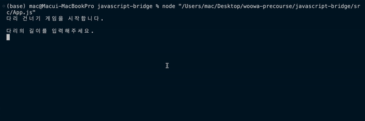
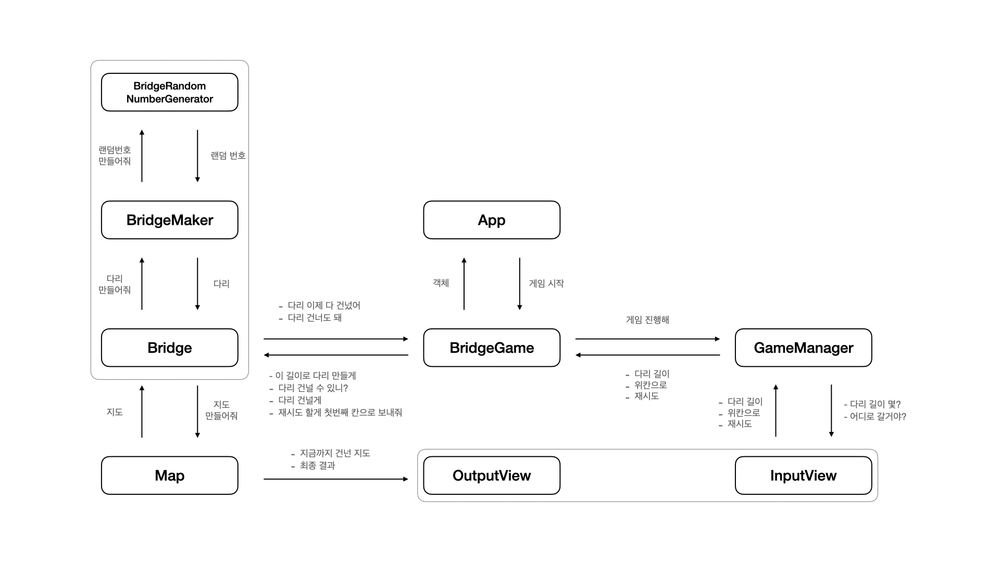

# 🎰 미션 - 다리 건너기

## 게임 설명

- 인기 콘텐츠 '오징어 게임' 속 유리 징검다리 게임에서 착안한 콘솔 게임
    

## 게임 규칙

1. 게임을 시작합니다.
2. 다리 길이를 입력하면 다리가 생성됩니다.
3. 다리의 U(위)와 D(아래) 중 건너고 싶은 칸을 입력합니다.
4. 선택한 칸을 건널 수 있다면 다리를 모두 건널 때까지 3,4번 단계를 반복합니다.
5. 선택한 칸을 건널 수 없다면 게임이 일시정지되며, 다리의 처음으로 돌아가 재시도하거나 종료할 수 있습니다.
6. 다리를 끝까지 건너면 게임이 종료됩니다.

  

## 실행 방법

- node 14.20.1 버전 사용
- `App.js`를 실행하여 게임을 시작할 수 있습니다.

  

## 설계

  

  

# 기능 목록

 

## 🌟 1. 도메인 로직

 
- [x] 플레이어가 입력한 길이만큼의 다리를 생성한다.

- [x] 다리는 위아래 두 칸으로 이루어져있다.
- [x] 위아래 둘 중 하나의 칸만 건널 수 있으며 0과 1 중 무작위 값을 이용해 정한다.
- [x] 0인 경우 아래 칸, 1인 경우 위 칸을 건널 수 있다.
- [x] 위 칸을 건널 수 있으면 U, 아래 칸을 건널 수 있으면 D로 나타낸다.

 
- [x] 플레이어가 선택한 다리의 위치가 건널 수 있는 위치인지 비교한다.

 
- [x] 게임을 진행한다.

- [x] 게임을 시작한다.
- [x] 게임을 종료한다.
- [x] 게임을 재시도한다.

 
- [x] 게임의 결과를 계산한다.

- [x] 게임을 시도한 횟수를 계산한다.
- [x] 게임의 성공 여부를 계산한다.
- [x] 게임 진행 여부를 계산한다.

  

## 💬 2. UI 로직

 

### 입력

- [x] 생성할 다리의 길이를 입력 받는다.
- [x] 다리의 위/아래 중 이동할 칸을 입력 받는다.
- [x] 게임의 재시도/종료 여부를 입력 받는다.

 

### 출력

- [x] 플레이어의 현재 위치를 다리와 함께 출력한다.
  - [x] 건넜으면 O, 건너지 못했으면 X로 표시한다.
- [x] 최종 플레이 결과를 출력한다.
  - [x] 플레이어의 최종 위치를 다리와 함께 출력한다.
  - [x] 게임 성공 여부를 출력한다.
  - [x] 총 시도 횟수를 출력한다.
- [x] 에러 메시지를 출력한다.

  

## ⛔ 3. 에러 로직

 

### 생성할 다리의 길이를 입력하는 경우

- [x] 숫자가 아닌 값을 입력하는 경우
- [x] 3~20 사이의 수가 아닌 경우
- [x] 소수점을 포함한 값을 입력하는 경우

### 다리의 위/아래 중 이동할 칸을 입력 받는 경우

- [x] 소문자 u 또는 d를 입력하는 경우
- [x] U 또는 D가 아닌 값을 입력하는 경우

### 게임의 재시도/종료 여부를 입력 받는 경우

- [x] 소문자 r 또는 q를 입력하는 경우
- [x] R 또는 Q가 아닌 값을 입력하는 경우
