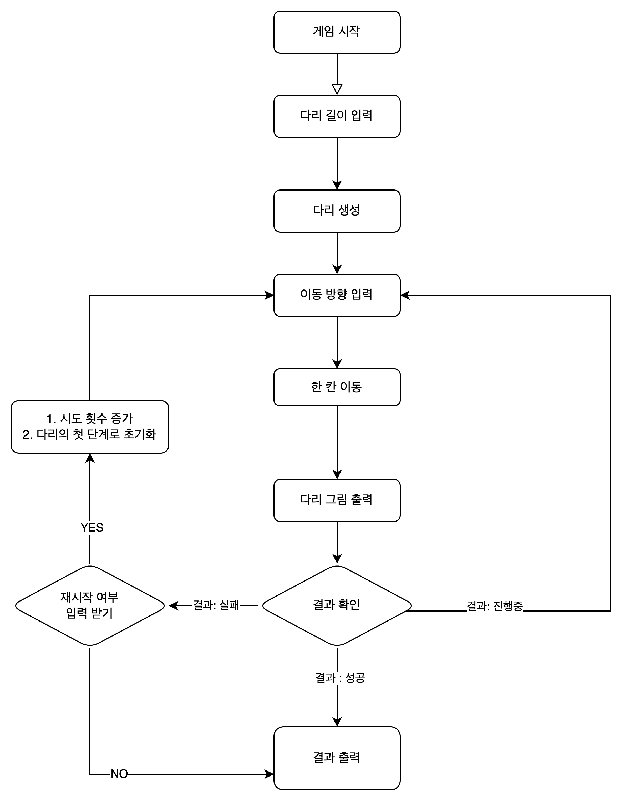

# 🌉 미션 - 다리 건너기

## 🔍 구현 목록

### 프로그램 순서

1. 게임을 시작합니다. ( ✅ )
2. 다리의 길이를 입력합니다.( ✅ )
   - ❗️ 3이상 20이하의 숫자가 아닐 경우 에러 메세지를 출력합니다. ( ✅ )
3. 새로운 다리를 만듭니다.( ✅ )
4. 이동 방향을 묻습니다. ( ✅ )
   - ❗️ U와 D 이외의 문자 입력이 있을 경우 에러 메세지를 출력합니다. ( ✅ )
5. 다음 칸으로 이동합니다. ( ✅ )
6. 다리 그림을 출력합니다. ( ✅ )
7. 게임 결과 상태를 확인합니다. ( ✅ )
   1. 진행 중 -> "\[4\]이동방향을 묻습니다."으로 돌아갑니다. ( ✅ )
   2. 성공 시 -> `[종료]결과를 출력합니다.(다리 그림, 게임 성공 여부, 총 시도한 횟수)` ( ✅ )
   3. 실패 시 -> 재시작 여부를 묻습니다. ( ✅ )
      1. 재시작 시 -> "\[4\]이동방향을 묻습니다."으로 돌아갑니다. 단, 시행횟수를 증가시키고, 다리의 처음 칸부터 다시 시작합니다. ( ✅ )
      2. 종료 시 -> `[종료]결과를 출력합니다.(다리 그림, 게임 성공 여부, 총 시도한 횟수)` ( ✅ )
   - ❗️ R과 Q 이외의 문자 입력이 있을 경우 에러 메세지를 출력합니다.

### 프로그램 순서도

