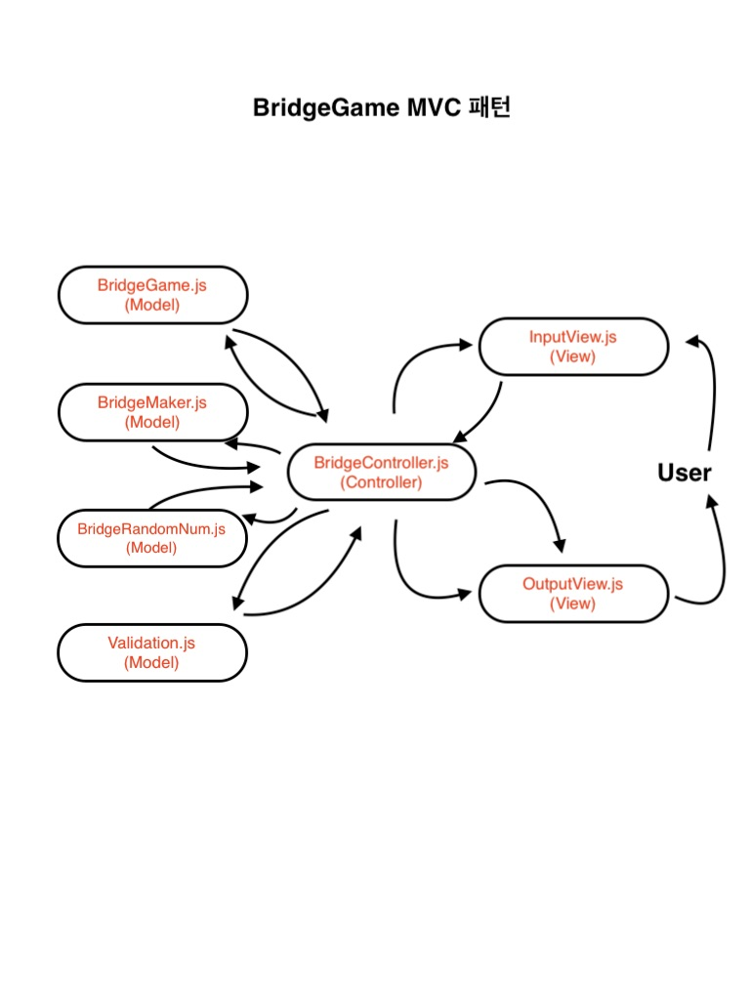
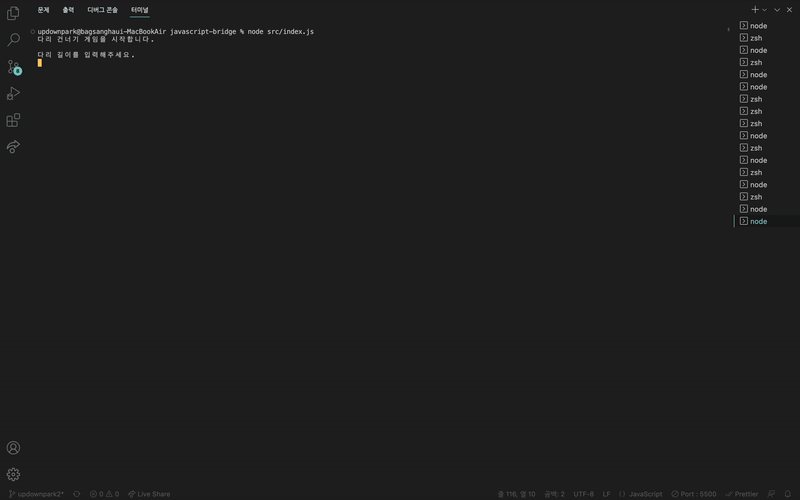

## 3주차 피드백 📣

1. 객체를 객체스럽게 사용하기
   => 객체가 일해서 값을 내놓도록하자 컨트롤러에서 값을 받아 일하는 것이 아니다.

- 모든 멤버변수의 getter를 막자!

2. 필드의 수를 최소화하자

- 3개만 사용!!

3. 테스트 코드 작성시 성공 케이스 뿐 아니라 예외에 대한 테스트도 실행할것

- test(each()) 사용해볼것!!

4. 테스트 코드도 리팩토링이 필요하다

- 더 나은 테스트 코드로 리팩토링필요

5. 구현코드 = 테스트 코드 즉, 구현하고자하는 코드에 어떤 함수가 추가되거나 축소되는 건 지양하자

6. 함수와 단위테스트는 가장한 작게!

## 4주차 미션 : 오징어게임 다리건너기 🦑

## 기능 목록 📚

⭕️ - 테스트 코드로 통과한 기능

1. 사용자에게 다리길이 입력받기

2. 입력값 타당성 검사 ⭕️

🚨 유저가 3~20 사이의 숫자를 입력했는지 확인 ⭕️
🚨 유저가 숫자만 입력 했는지 확인 ⭕️
🚨 오류 발생 후 그 시점에서 다시 입력받기 ⭕️

3. 입력 받은 다리길이와 랜덤 변수를 활용하여 다리 생성 ⭕️

4. 사용자에게 이동할 칸 입력받기

5. 입력값 타당성 검사 ⭕️

🚨 대문자로 작성했는지 확인 ⭕️
🚨 U 또는 D만 입력했는지 확인 ⭕️
🚨 U 또는 D 한 알파벳만 입력했는지 확인 ⭕️
🚨 오류 발생 후 그 시점에서 다시 입력받기

6. 유저의 이동의 통과/실패 판단 후 결과를 배열에 저장 ⭕️

🚨 이동 결과는 boolean 타입으로 판단 ⭕️
🚨 유저의 움직임에 따라 통과면 "O" 실패면 "X"를 이중 배열에 저장 ⭕️

7. 유저의 다리 이동 결과에 따라 출력

🚨 유저의 이동이 통과/실패 상관 없이 최근 이동한 결과를 출력
🚨 유저가 마지막 다리 이동에 성공 했을 때 게임 결과 출력 및 종료

7. 유저의 이동이 통과 일 때 다음 이동 칸 입력받기

- 입력값 타당성 검사 5.번과 동일 ⭕️

8. 유저의 이동이 실패 일 때 유저에게 재시작/종료 입력받기

9. 입력값 타당성 검사 ⭕️

🚨 대문자로 작성했는지 확인 ⭕️
🚨 R 또는 Q만 입력했는지 확인 ⭕️
🚨 R 또는 Q 한 알파벳만 입력했는지 확인 ⭕️

10. 입력값에 따라 재시작/종료 판단 ⭕️

🚨 Boolean 타입으로 반환 ⭕️

11. 게임 재시작 시 게임 환경 리셋(⭕️) 및 사용자에게 이동할 칸 입력받기

12. 게임 종료 시 게임 최종 결과, 게임성공여부 및 시도 횟수 출력

13. 인스턴스 종료

## MVC 패턴

## 게임 실행 결과

