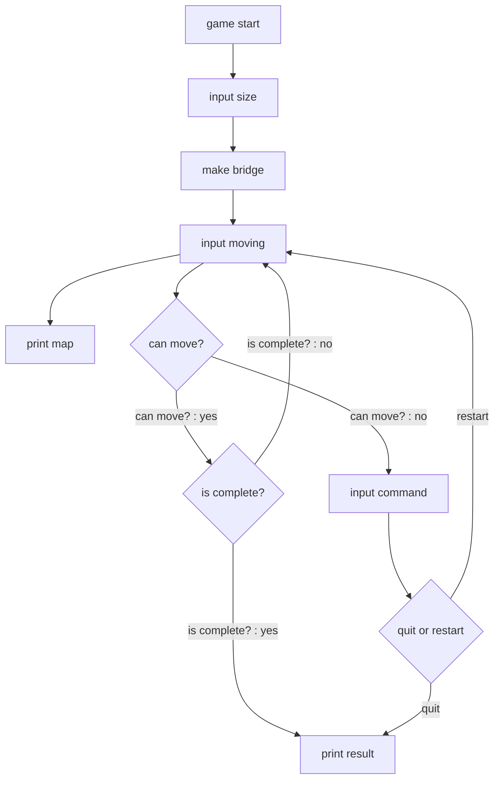

# 🌉 다리 미션 - 기능 목록

---

## Flow Chart

## 기능 목록

게임 시작

- 다리 길이 입력 (number)
- 입력받은 다리 길이로 다리 생성
- 이동할 칸 입력 (U 또는 D)
- 입력받은 칸으로 다리 이동
    - 이동 후 현재 다리 출력
    - 이동 가능 여부 판단
        - 가능 : 다시 이동할 칸 입력
        - 불가능 : 게임 종료 옵션 입력
    - 다리길이만큼 이동 완료
        - 결과 출력
- 게임 종료 옵션 입력받기 (R 또는 Q)
    - R : 다시 이동할 칸 입력받기, 시도 횟수 +1
    - Q : 결과 출력하기
- 결과 출력하기

