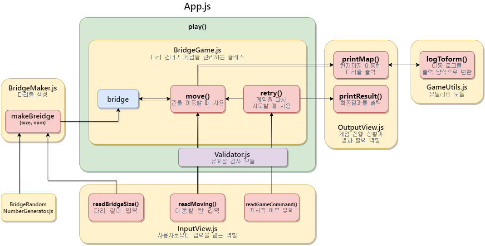

# 프리코스 4주차 -다리 건너기-🌉

## 🚀기능 요구 사항

위아래 둘 중 하나의 칸만 건널 수 있는 다리를 끝까지 건너가는 게임이다.

- 위아래 두 칸으로 이루어진 다리를 건너야 한다.
  - 다리는 왼쪽에서 오른쪽으로 건너야 한다.
  - 위아래 둘 중 하나의 칸만 건널 수 있다.
- 다리의 길이를 숫자로 입력받고 생성한다.
  - 다리를 생성할 때 위 칸과 아래 칸 중 건널 수 있는 칸은 0과 1 중 무작위 값을 이용해서 정한다.
  - 위 칸을 건널 수 있는 경우 U, 아래 칸을 건널 수 있는 경우 D값으로 나타낸다.
  - 무작위 값이 0인 경우 아래 칸, 1인 경우 위 칸이 건널 수 있는 칸이 된다.
- 다리가 생성되면 플레이어가 이동할 칸을 선택한다.
  - 이동할 때 위 칸은 대문자 U, 아래 칸은 대문자 D를 입력한다.
  - 이동한 칸을 건널 수 있다면 O로 표시한다. 건널 수 없다면 X로 표시한다.
- 다리를 끝까지 건너면 게임이 종료된다.
- 다리를 건너다 실패하면 게임을 재시작하거나 종료할 수 있다.
  - 재시작해도 처음에 만든 다리로 재사용한다.
  - 게임 결과의 총 시도한 횟수는 첫 시도를 포함해 게임을 종료할 때까지 시도한 횟수를 나타낸다.
- 사용자가 잘못된 값을 입력한 경우 `throw`문을 사용해 예외를 발생시키고, "[ERROR]"로 시작하는 에러 메시지를 출력 후 그 부분부터 입력을 다시 받는다.

## 🤔입출력 요구 사항

### ⌨입력

- 자동으로 생성할 다리 길이를 입력 받는다. 3 이상 20 이하의 숫자를 입력할 수 있으며 올바른 값이 아니면 예외 처리한다.

```
3
```

- 라운드마다 플레이어가 이동할 칸을 입력 받는다. U(위 칸)와 D(아래 칸) 중 하나의 문자를 입력할 수 있으며 올바른 값이 아니면 예외 처리한다.

```
U
```

- 게임 재시작/종료 여부를 입력 받는다. R(재시작)과 Q(종료) 중 하나의 문자를 입력할 수 있으며 올바른 값이 아니면 예외 처리한다.

```
R
```

### 📺출력

- 게임 시작 문구

```
다리 건너기 게임을 시작합니다.
```

- 게임 종료 문구

```
최종 게임 결과
[ O |   |   ]
[   | O | O ]

게임 성공 여부: 성공
총 시도한 횟수: 2
```

- 사용자가 이동할 때마다 다리 건너기 결과의 출력 형식은 실행 결과 예시를 참고한다.
  - 이동할 수 있는 칸을 선택한 경우 O 표시
  - 이동할 수 없는 칸을 선택한 경우 X 표시
  - 선택하지 않은 칸은 공백 한 칸으로 표시
  - 다리의 시작은 `[`, 다리의 끝은 `]`으로 표시
  - 다리 칸의 구분은 `|`(앞뒤 공백 포함) 문자열로 구분
  - 현재까지 건넌 다리를 모두 출력
- 예외 상황 시 에러 문구를 출력해야 한다. 단, 에러 문구는 "[ERROR]"로 시작해야 한다.

```
[ERROR] 다리 길이는 3부터 20 사이의 숫자여야 합니다.
```

### 🛫실행 결과 예시

```
다리 건너기 게임을 시작합니다.

다리의 길이를 입력해주세요.
3

이동할 칸을 선택해주세요. (위: U, 아래: D)
U
[ O ]
[   ]

이동할 칸을 선택해주세요. (위: U, 아래: D)
U
[ O | X ]
[   |   ]

게임을 다시 시도할지 여부를 입력해주세요. (재시도: R, 종료: Q)
R
이동할 칸을 선택해주세요. (위: U, 아래: D)
U
[ O ]
[   ]

이동할 칸을 선택해주세요. (위: U, 아래: D)
D
[ O |   ]
[   | O ]

이동할 칸을 선택해주세요. (위: U, 아래: D)
D
[ O |   |   ]
[   | O | O ]

최종 게임 결과
[ O |   |   ]
[   | O | O ]

게임 성공 여부: 성공
총 시도한 횟수: 2
```

```
다리 건너기 게임을 시작합니다.

다리의 길이를 입력해주세요.
3

이동할 칸을 선택해주세요. (위: U, 아래: D)
U
[ O ]
[   ]

이동할 칸을 선택해주세요. (위: U, 아래: D)
U
[ O | X ]
[   |   ]

게임을 다시 시도할지 여부를 입력해주세요. (재시도: R, 종료: Q)
Q
최종 게임 결과
[ O | X ]
[   |   ]

게임 성공 여부: 실패
총 시도한 횟수: 1
```

## ✍구현 기능 목록

- [x] **게임 시작 문구 출력하기**
  - [x] `다리 건너기 게임을 시작합니다.` 출력
- [x] **다리 길이 입력 받기**
- [x] **다리 길이 유효성 검사**
  - [x] 입력 값이 1~20 사이의 숫자인가?
  - [x] 입력 값이 소수인가?
- [x] **다리 생성하기**
  - [x] `BridgeRandomNumberGenerator`를 사용해 생성된 값이 0이면 아래칸, 1이면 윗칸을 건널수 있는 칸으로 설정
  - [x] 입력된 다리 길이만큼 반복
- [x] **이동할 칸 입력받기**
  - [x] `이동할 칸을 선택해주세요. (위: U, 아래: D)` 출력
  - [x] 소문자일시 대문자로 변경
- [x] **이동할 칸 유효성 검사**
  - [x] 입력값이 `U`나 `D`인가?
- [x] **입력된 값으로 결과 판단하기**
- [x] **현재 진행상황 출력하기**
- [x] **진행 성공시 성공 횟수와 다리 길이를 비교해서 게임 클리어 판단**
  - [x] 다리 길이보다 성공 횟수가 적을시 이동할 칸 입력부터 재실행
  - [x] 다리 길이와 성공 횟수가 같을시 게임 종료 로직 실행
    - [x] 최종 게임 결과 출력
    - [x] `게임 성공 여부: 성공` 출력
    - [x] `총 시도한 횟수` 출력
- [x] **진행 실패시 게임 재시작 여부 입력받기**
  - [x] 최종 게임 결과 출력
  - [x] `게임 성공 여부: 실패` 출력
  - [x] 재시작 여부 입력받기
  - [x] 재시작 여부 유효성검사
    - [x] 입력값이 `R`이나 `Q`인가?
  - [x] 입력 값이 `R`일시 이동할 칸 입력받기부터 재시작
  - [x] 입력 값이 `Q`일시 게임 종료 로직 실행
    - [x] 최종 게임 결과 출력
    - [x] `게임 성공 여부: 실패` 출력
    - [x] `총 시도한 횟수` 출력

## 🖥기능 로직


## 📂디렉토리 및 메서드


