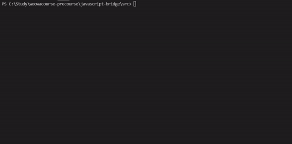

# 미션 - 다리 건너기

## 개요
위아래 둘 중 하나의 칸만 건널 수 있는 다리를 끝까지 건너가는 게임을 구현한 것이다.
  

---

## 실행 화면
프로그램 실행 시 콘솔을 통해 입출력을 진행한다.   
  

---

## 실행 방법
다음 명령어를 통해 프로그램을 실행할 수 있다.

    1. clone을 통해 자신의 pc로 복제
    git clone https://github.com/SuHwa-Lee/javascript-bridge.git
    2. 브랜치 변경
    git checkout SuHwa-Lee
    3. src 폴더로 이동
    cd src
    4. index.js 실행파일 실행
    node index.js

---

## 기능 목록
프로그램의 주요 기능 목록이다. 앞에 번호가 붙은 제목이 프로그램의 주요 흐름을 나타낸다. 작성은 주요 기능 아래 예외처리 / 조건들로 작성해주었다. 구현 완료시 ✅를 사용하여 구현이 완료된 기능임을 명시하였다. 
  
기능 완료 이전에 1. 실패하는 테스트 코드를 작성하고, 2. 기능을 구현하여 3. 테스트 코드가 작동하는 <code>TDD</code>개발방식을 사용하였다.   커밋은 하나의 기능 단위로 진행하였으며 테스트 코드 작성 -> 기능 구현 -> 테스트 -> 리팩토링 순으로 진행하였다.
 

### 0. 게임 시작 (✅)
    입출력
      🖨️ : 다리 건너기 게임을 시작합니다.
### 1. 다리 길이 입력받기 (test ✅)
    [✅] 조건 : 사용자에게 자동으로 생성할 다리 길이를 입력받기
    [✅] 예외 : 다리 길이가 3 이상 20 이하가 아닌 경우
    [✅] 예외 : 다리 길이가 숫자가 아닌 경우 (문자이거나 공백 포함)
    
    입출력
      🖨️ : 다리의 길이를 입력해주세요.
      🧑🏻‍💻 : 3
 
### 2. 다리 생성하기 (test ✅)
    [✅] 조건 : 랜덤 값이 0인 경우 아래 칸이 건널 수 있고, 1인 경우 위 칸이 건널 수 있음
    [✅] 조건 : 다리 생성 시, 위 칸과 아래 칸 중 건널 수 있는 칸은 0과 1 중에서 무작위로 선정

### 3. 사용자가 이동할 칸 선택하기 (test ✅)
    [✅] 조건 : 사용자가 위 칸 이동시 대문자 U, 아래 칸 이동시 대문자 D를 입력
    [✅] 조건 : 입력 후 이동한 칸을 건널 수 있다면 O, 없다면 X로 출력
    [✅] 예외 : 사용자의 입력이 U나 D가 아닌 경우

    입출력
      🖨️ : 이동할 칸을 선택해주세요. (위: U, 아래: D)
      🧑🏻‍💻 : U or D
      🖨️ : 이동후 현재까지 건넌 다리 출력
          [ O | X ] 
          [   |   ]

### 4. 실패 시 재시작 or 종료 결정하기 (test ✅)
    [✅] 조건 : 재시작해도 처음에 만든 다리로 재사용 (다리 입력받지 않고 이동할 칸 선택하도록)
    [✅] 조건 : 사용자가 다시 시작시 R, 종료시 Q를 입력
    [✅] 예외 : 사용자의 입력이 R이나 Q가 아닌 경우

    입출력
      🖨️ : 게임을 다시 시도할지 여부를 입력해주세요. (재시도: R, 종료: Q)
      🧑🏻‍💻 : R or Q

### 5. 성공 시 종료
    [✅] 조건 : 게임 성공 여부와 총 시도 횟수 출력

    입출력
      🖨️ : 게임 성공 여부: 성공 or 실패
           총 시도한 횟수: 2

 

####  사용자가 잘못된 값을 입력한 경우 throw문을 사용해 예외를 발생시키고, "[ERROR]"로 시작하는 에러 메시지를 출력 후 그 부분부터 입력을 다시 받는다.   

---

## 클래스 설계
클래스의 필드와 메서드를 표로 나타낸 것이다. 클래스는 총 3개를 생성하여 구현하였다. 

|--|App|BridgeController|BridgeGame|
|--|--|--|--|
|필드|--|--|#bridgeInfo #moveCnt #moveInfo #tryCnt|
|메서드||start() requestBridegeSize() createBridge(bridgeSize) bridgeSizeException(bridgeSize) requestMoving() createMoving(moving) movingException(moving) handleMovingResult(result) requestRetry() createRetry(command) handleRetryResult(result) commandException(command)|move(moving) retry(command) retrySetting()
|설명|BridgeController을 생성 후 실행|프로그램 전체 흐름 진행|다리 데이터 관리 및 주요 로직 처리|--|

---
 

## 클래스 상세 설명

총 3개의 클래스로 분리하였다. 다음은 각각의 메서드에 대한 상세 기능 설명이다. 

### 1. App

    play(): BridgeController 객체를 생성하여 실행시킨다.

### 2. BridgeController

    여기서는 프로그램의 주요 흐름을 함수 호출을 통해 실행시켜 주었다. 
    아래와 같이 3가지의 주요 흐름으로 나눌 수 있다.
    
      1. 사용자가 다리 길이를 입력하고, 입력한 다리 길이만큼 다리를 생성하여 저장한다. 
      2. 사용자가 이동 방향을 입력하고, 갈 수 있는지 판단하여 결과를 보여준다. 
      3. 사용자가 실패 시 재시작/종료여부를 선택하고, 재시작과 종료에 맞는 로직을 처리해준다.

    3가지의 흐름에 대한 로직이 반복되어 함수명을 통일시켜 주었다. 
    
      1. request-- : 해당 함수는 사용자의 입력을 받는 함수이다. inputView 객체의 read--함수를 호출하며, this 바인딩을 사용하여 callback함수로 create--함수를 바인딩해주었다. 
      2. create-- : 해당 함수는 사용자 입력값에 대한 예외처리 이후, 예외가 발생하지 않는다면 입력을 받은 이후의 로직을 처리한다. 
      3. --Exception : 해당 함수는 사용자 입력값에 대한 예외처리를 구현한다. try-catch문으로 구현하였으며, 요구사항에 맞게 try에서 에러 발생시, catch문을 통해 잘못된 입력에 대해 재입력을 요청하도록 해주었다. 
  
    start()함수는 BridgeController 객체 생성시 생성자로 실행되는 함수이자 프로그램을 시작시키는 함수이다.   
 

### 3. BridgeGame

  ### Field

    - bridgeInfo: 랜덤으로 생성된 다리를 저장한다.
    - moveCnt: 지금까지의 이동 횟수를 저장한다.
    - moveInfo: 지금까지의 이동 정보를 U, D의 값을 가진 배열 형태로 저장한다. 
    - tryCnt: 지금까지의 시도 횟수를 저장한다.
    
  ### Method
    move(이동하고 싶은 값): 사용자가 U 또는 D를 입력하면 해당 입력에 대한 결과값을 반환하며 다음과 같은 로직을 가진다. 
    
      1. 생성된 다리와 사용자가 입력한 다리에 대한 값이 일치하지 않는다면 'fail'을 반환한다.
      2. 생성된 다리와 일치하며, 생성된 다리 길이와 이동 횟수 +1을 한 값이 일치하면 다리를 모두 건넌 것이므로 'success'를 반환한다.
      3. 생성된 다리와 일치하지만, 2번의 경우가 아닌 경우는 아직 다리를 다 건너지 못한 것이므로 'next'를 반환한다. 
    
    retry(명령어): 사용자가 R 또는 Q를 입력하면 해당 입력에 대한 결과값을 반환하며, 다음과 같은 로직을 가진다. 

      1. 사용자의 입력이 R인 경우에는 재시도를 하고싶다는 것이므로 BridgeGame내의 retrySetting 메서드를 실행시키고 'retry'를 반환한다. 
      2. 사용자의 입력이 Q인 경우에는 종료를 하고싶다는 것이므로 'quit'을 반환한다. 

    retrySetting(): 재시도를 할 때 호출되는 함수로, 시도 횟수를 1 증가하고, 지금까지의 이동 정보와 횟수를 모두 0으로 초기화시킨다.

 

## 객체 설계
객체의 프로퍼티와 메서드를 표로 나타낸 것이다.

|--|InputView|OutputView|BridgeMaker|BridgeRandomNumberGenerator|
|--|--|--|--|--|
|프로퍼티|--|--|--|--|
|메서드|readBridgeSize readMoving readGameCommand|printMap(moveInfo) printResult(moveInfo, tryCnt, successFlag) printStart() printError(err) printClose() processMap(move)|makeBridge(size, generateRandomNumber)|generate() |

## 객체 상세 설명

총 4개의 객체로 분리하였다. 다음은 각각의 객체에 대한 기능을 설명하였다.

    InputView : 사용자로부터 입력을 받는 역할을 한다.
    OutputView : 사용자에게 게임 진행 상황과 결과를 출력하는 역할을 한다.
    BridgeMaker : 다리의 길이를 입력 받아서 다리를 생성해주는 역할을 한다.
    BridgeRandomNumberGenerator : 0과 1사이의 난수를 생성한다.

 

---
## 파일 목록
프로그램을 구성하는 파일 목록이다. 

    📁 src
    │  📁 App.js
    │  📁 BridgeController.js
    │  📁 BridgeGame.js
    │  📁 BridgeMaker.js
    │  📁 BridgeRandomNumberGenerator.js
    │  📁 index.js
    │  📁 InputView.js
    │  📁 OutputView.js
    │  
    ├─ 📁 const
    │      📁 Bridge.js
    │      📁 Error.js
    │      📁 Text.js
    │      
    └─ 📁 utils
           📁 Exceptions.js