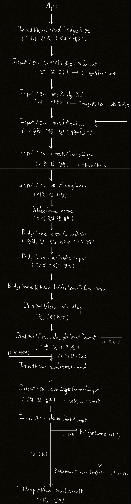

# **🌁 다리 게임 미션 🌉**

 

## **🏁 미션 설명**

요약: 다리의 길이를 입력받고 위아래 두 칸으로 이루어진 다리를 건넌다. 위아래 둘 중 하나의 칸만 건널 수 있게 설정되어 있는데, 플레이어는 답을 모르는 상태에서 이동할 칸을 선택한다. 다리를 끝까지 건너는데 성공하면 게임이 종료되며, 실패하면 게임을 재시작하거나 종료한다.

 
 

## **📝 기능 구현 목록** ##
- [x] get bridge size input from user
    - [x] check if input is valid (e.g., 3~20)
- [x] make bridge of designated size (e.g., ["U", "D", "D"])
- [x] get movement input from user
    - [x] check if input is valid (e.g., "U" or "D")
    - [x] move player (e.g., "O" or "X")
        - [x] compare user input with the bridge answer (e.g., ["U", "D", "D"]) and record "O" or "X"
- [x] print movement status
- [x] print results (if user input is "Q" or when user succeeds to cross the bridge)
- [x] get game command input from user
    - [x] check if input is valid (e.g., "R" or "Q")
- [x] retry game (if user input is "R")

 
 

## **🧪 테스트 구현 목록** ##
- [x] check if bridge size input is valid
    - [x] check if input is an integer
    - [x] check if input is in range (3~20)
- [x] check if movement input is valid
    - [x] check if input is "U" or "D"
- [x] check if game command input is valid
    - [x] check if input is "R" or "Q"
- [x] check if BridgeGame class works properly
    - [x] check if move method works properly
    - [x] check if checkCorrectOrNot method works properly
    - [x] check if setBridgeOutput method works properly
    - [x] check if retry method works properly
- [x] check if BridgeRandomNumberGenerator object works properly
    - [x] check if generate method works properly
- [x] check if BridgeMaker object works properly
    - [x] check if makeBridge method works properly

🚨 [NOTICE] Test for InputView, OutputView object is excluded since UI logic test is not required 🚨 
    
 
 

## **🗂️ 폴더 구성**
javascript-bridge  
┣ **`__tests__`**  
┃ ┣ ApplicationTest.js    
┃ ┣ BridgeGameTest.js   
┃ ┣ BridgeMakerTest.js  
┃ ┣ BridgeRandomNumberGeneratorTest.js  
┃ ┣ BridgeSizeCheckTest.js  
┃ ┣ MoveCheckTest.js   
┃ ┗ RetryQuitCheckTest.js  
┣ **`docs`**    
┃ ┗ README.md  
┣ **`src`**  
┃ ┣ **`Check`**  
┃ &nbsp;&nbsp;&nbsp;&nbsp;┣ BridgeSizeCheck.js  
┃ &nbsp;&nbsp;&nbsp;&nbsp;┣ MoveCheck.js  
┃ &nbsp;&nbsp;&nbsp;&nbsp;┗ RetryQuitCheck.js  
┃ ┣ **`Constants`**   
┃ &nbsp;&nbsp;&nbsp;&nbsp;┗ Constants.js  
┃ ┣ App.js  
┃ ┣ BridgeGame.js  
┃ ┣ BridgeGameToView.js  
┃ ┣ BridgeMaker.js  
┃ ┣ BridgeRandomNumberGenerator.js  
┃ ┣ InputView.js  
┗ ┗ OutputView.js
    
 
 

## **🗄️ 파일 설명**
**`<__tests__>`**  
- **`ApplicationTest.js`**  
    - test on overall program
- **`BridgeGameTest.js`**  
    - test on BridgeGame class
- **`BridgeMakerTest.js`**  
    - test on BridgeMaker object
- **`BridgeRandomNumberGeneratorTest.js`**  
    - test on BridgeRandomNumberGenerator object
- **`BridgeSizeCheckTest.js`**  
    - test on BridgeSizeCheck class
- **`MoveCheckTest.js`**  
    - test on MoveCheck class
- **`RetryQuitCheckTest.js`**  
    - test on RetryQuitCheck class  

**`<docs>`**
- **`README.md`**  
    - document file on the project

**`<src>`**
- **`<Check>`**
    - **`BridgeSizeCheck.js`**  
        - validate bridge size input (3-20)
    - **`MoveCheck.js`**  
        - validate movement input ("U" or "D")
    - **`RetryQuitCheck.js`**  
        - validate game command input ("R" or "Q")

- **`<Constants>`**
    - **`Constants.js`**  
        - constant numbers and messages used in the project
- **`App.js`**  
    - starting point of the program
- **`BridgeGame.js`**  
    - main logic of the program
- **`BridgeGameToView.js`**  
    - link BridgeGame with In/OutputView
- **`BridgeMaker.js`**  
    - make bridge of designated size
- **`BridgeRandomNumberGenerator.js`**  
    - generate random number for bridge
- **`InputView.js`**  
    - get user input
- **`OutputView.js`**  
    - print output

 
 

## **📚 참고 자료: 프로그램 로직**
