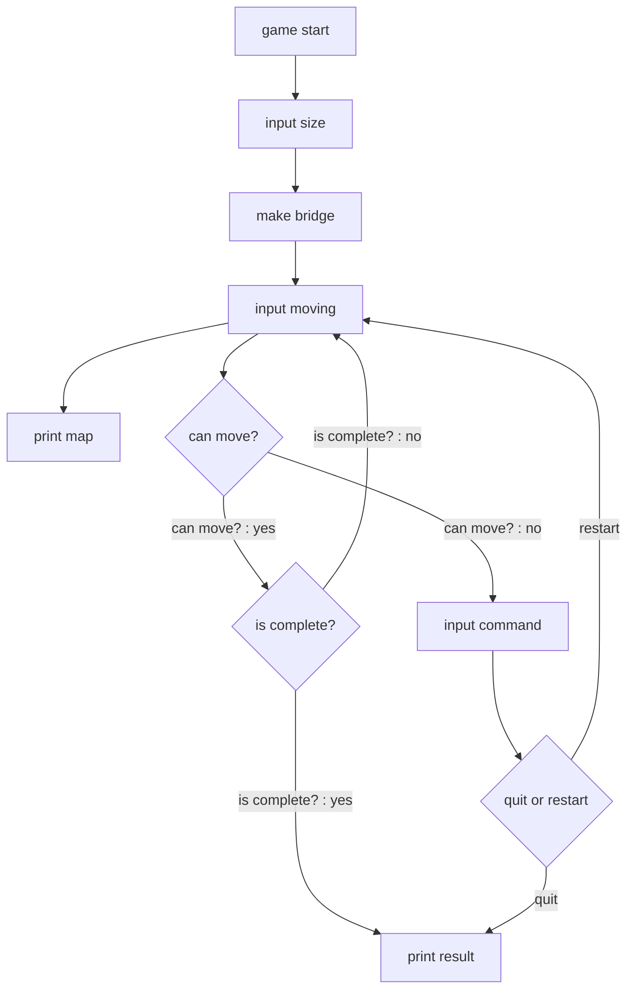

# 🌉 다리 미션 - 기능 목록

---

## Flow Chart

## 기능 목록

- 게임 시작
- 다리 길이 입력 `number`
- 입력받은 다리 길이로 다리 생성
- 이동할 칸 입력 `U 또는 D`
- 입력받은 칸으로 다리 이동
    - 이동 후 현재 다리 출력
    - 이동 가능 여부 판단
        - 가능 : 다시 이동할 칸 입력
        - 불가능 : 게임 종료 옵션 입력
    - 다리길이만큼 이동 완료
        - 결과 출력
- 게임 종료 옵션 입력받기 `R 또는 Q`
    - R : 다시 이동할 칸 입력받기, 시도 횟수 +1
    - Q : 결과 출력하기
- 결과 출력하기

## 예외 처리

- 다리 길이 입력
    - 숫자
    - 3 이상 20 이하의 값
- 다리 이동 입력
    - U 또는 D
- 게임 종료 옵션 입력
    - R 또는 Q

## 단위 테스트 목록

<aside>
📖 입력 예외 처리 테스트

</aside>

- 다리 길이 입력
- 다리 이동 입력
- 게임 종료 옵션 입력

<aside>
📖 기능 작동 테스트

</aside>

- **BridgeGame -** BridgeGameTest.js
    - `move(moving)` : 이동한 칸을 방문 목록(moved)에 추가한다
    - `status()` : 이동한 결과를 판단하여 해당하는 값을 반환한다
        - 0 : 이동할 칸 틀림 - CAN NOT MOVE
        - 1 : 이동할 칸 맞음 - CAN MOVE
        - 2 : 다리 건너기 완료 - MOVE COMPLETE
    - `retry()` : 시도 횟수(attempts)를 추가하고, moved 를 초기화한다
    - `get()` : 사용자 게임 정보를 반환한다 (moved, attempts)
- **BridgePlay -** BridgePlayTest.js
    - `playRound(moving)` : 이동 후의 현재 이동 상태를 받아 출력 함수로 전달한다.
    - `playNext()` : 이동 결과를 받아 올바른 다음 단계로 넘어간다.
    - `endOrRetry(option)` : 입력받은 옵션에 따라 게임을 종료/진행한다.
    - `playEnd()` : 게임 종료 - 게임 정보를 받아 출력 함수로 전달한다.