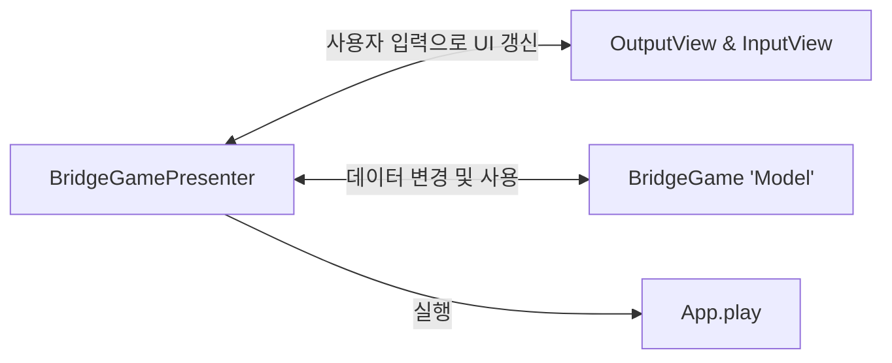

🚀 기능 요구 사항 파악하기

위아래 둘 중 하나의 칸만 건널 수 있는 다리를 끝까지 건너가는 게임이다.

## 기능 목록

### UI 요소 정렬해보기

- 게임 시작 문구 출력
- 다리 길이 입력 문구 출력 & 입력
- 이동칸 문구 출력 & 입력
- 게임 재시도 여부 문구 출력 & 입력
- 다리 출력(입력마다 변화한다.)
- 최종 게임 결과 출력
- 에러 메시지 출력

### 최종 기능 목록 정리

- 입력 뷰: `InputView`
  - [x] 다리 길이 입력
  - [x] 이동 칸 입력
  - [x] 게임 재수도 여부 입력
- 출력 뷰: `OutputView`
  - [x] 시작 문구 출력
  - [x] 개행 출력
  - [x] 게임 진행 시 다리 출력
  - [x] 게임 결과 출력
- 모델: `BridgeGame`
  - [x] 데이터 선언
    - 정답이 되는 다리 데이터
    - 유저가 입력한 다리 데이터
    - 재시도 횟수 데이터
  - 메서드
    - [x] 사용자가 칸을 이동할 때 사용할 메서드
    - [x] 사용자가 게임을 다시 시작할 때 사용할 메서드
    - [x] 사용자 다리와 정답 다리를 비교하는 메서드
    - [x] 사용자 다리와 정답 다리가 똑같아졌는지 비교하는 메서드
    - [x] 사용자 다리를 출력 형식에 맞게 만드는 메서드
    - [x] 결과 데이터를 보내는 메서드
- 프레젠터: `BridgeGamePresenter`

  - [x] 필드로 모델인 `BridgeGame`을 갖는다.
  - [x] 게임 실행
  - 페이즈 분리
    - [x] 다리를 건너는 페이즈
    - [x] 재시도 페이즈
    - [x] 게임 종료 페이즈

- 나머지 파일(유틸, 유효성 검사, 테스트 코드)
- 테스트코드 작성
  - [x] 다리 생성 기능이 정상 동작 하는가?
  - [x] 다리 그리기 기능이 정상 동작 하는가?
  - [x] 입력값에 대한 유효성 검사
- 입력값에 대한 예외 처리
  - [x] 다리 길이 입력값이 3~20사이의 숫자인지 확인 후 `boolean` 값 전달
  - [x] 라운드별 입력값이 `U`아니면 `D`인지 확인 후 `boolean` 값 전달
  - [x] 재시작 종료 여부 입력값이 `R`아니면 `Q`인지 확인 후 `boolean` 값 전달
- [x] 잘못 입력한 경우 예외를 발생시켜 에러 메시지를 출력, 에러를 일으킨 입력부터 다시 시작

리팩토링

- [x] 상수 분리하기
  - [x] 메시지
  - [x] 다리와 게임 관련 상수
- [x] 에러와 유효성 검사 클래스 분리 및 연결
- [x] 다리를 그리는 메서드 수정 및 분리
- [ ] try catch를 어디에 선언하고 유효성 검사를 어디서 진행할 지 확정하기

## 구조 및 전제 설정

### 구조 분리

- 입력을 받는 뷰(사실 상 입력을 하는 유저로 보았다.)
- 출력을 하는 뷰
- 데이터와 비즈니스 로직을 담는 모델
- 뷰와 모델을 연결할 프레젠터

### 좋은 아키텍처 찾기

- mvc, mvvm, mvp, mvi... mv\* 패턴 중에 서 무엇을 선택 할 것인가?
  - mvvm ❌
    - viewmodel을 구현하기에는 이번 요구 사항과 적합하지 않다고 판단하였다.
  - mvi ❌
    - 구현을 위해 모델이 뷰에 접근할 필요가 있다.
    - BridgeGame을 모델로 사용할 것이기 때문에 BridgeGame은 뷰에 접근할 수 없어 부적합하다.
  - mvc와 mvp ⭕
    - MVC의 방식에서 모델과 뷰가 의존하지 않게 만들면 MVP가 된다. 따라서 기본적으로 MVC를 따른다.
    - 이후 모델과 뷰가 의존하지 않게 설계 가능하다면, MVP로 명칭을 바꾼다.

이번 문제는 뷰와 모델이 의존성이 없어도 되므로 MVP 패턴을 이용한다.

- Model, View, Presenter

### 각 구조 전제 조건 설정

의존성

- A 파일에 B 파일의 코드가 있으면 A는 B에 의존성이 있는것이다.

  - 하지만 B는 A에 의존성이 있다고 할 수 없다.
  - 다음과 같은 관계를 `A->B`로 표현한다.

- 입력을 받는 **`뷰`** 와 출력을 하는 **`뷰`**
  - 본인을 제외한 뷰, 프레젠터에 의존성이 없어야한다.
  - 모델을 의존할 수는 있으나 이 경우는 사용자에 따라 다른 정보를 보여줘야할 경우로 한정한다.
    - 이번 프로그램의 경우 사용자에 따라 같은 정보를 보여주므로 **모델에도 의존성을 두지 않는다.**
    - 입력에 필요한 인자 값은 반드시 프레젠터에서부터 받는다.
- 입력을 받는 **`뷰`**
  - 각 메서드는 인자를 통해 프레젠터부터 **`콜백 함수`** 를 전달받을 수 있다.
- 출력을 하는 **`뷰`**
  - 각 메서드는 인자를 통해 프레젠터부터 **`모델 데이터`** 를 전달받을 수 있다.
- 데이터와 비즈니스 로직을 담는 **`모델`**
  - 프레젠터와 뷰에 의존성이 없어야한다.
  - 데이터를 필드에 저장할 수 있다.
  - 비즈니스 로직을 메서드로 가질 수 있다.
- 뷰와 모델을 연결할 **`프레젠터`**
  - 모델과 뷰에 의존성이 있다.
  - 출력을 하는 뷰를 구성할 때 모델의 데이터를 뷰에 전달해준다.

### 뷰, 모델, 프레젠터 설정

기본적으로 주어진 파일에 프레젠터를 추가하였다.

- 입력 뷰: `InputView`
- 출력 뷰: `OutputView`
- 모델: `BridgeGame`
- 프레젠터: `BridgeGamePresenter`

이를 바탕으로 기능 목록을 재작성하였다.

### 구조 그려보기

