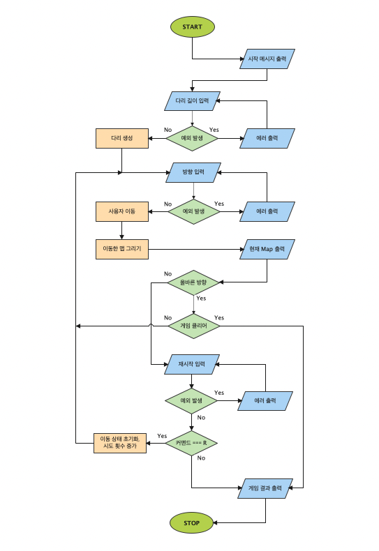

# 다리

## 🧚 당신의 운을 시험해보세요

### 몇번의 시도로 다리를 건너실 수 있을까요!?

#### 위아래 두 칸으로 이루어진 다리를 건너야 합니다

#### 최소한의 시도로 다리를 건너보세요

1. 3에서 20까지의 숫자를 입력해서 다리를 생성해 주세요
2. 건널 방향을 선택해 주세요 (위쪽 방향이라면 U, 아래쪽 방향이라면 D 를 입력해주
   세요)
3. 실패하더라도 걱정마세요 얼마든지 재시도할 수 있습니다 (재시도를 원하시면 R,
   종료를 원하시면 Q 를 입력해주세요)
4. 끝까지 다리를 건너 몇번의 시도로 성공했는지 확인하세요!

---

## ⏰ Flow Map



---

## 🪜 애플리케이션 구조

```bash
📦src
 ┣ 📂constant
 ┃ ┗ 📜index.js                         - 게임에서 사용하는 상수값을 변수로 선언
 ┣ 📂controller
 ┃ ┗ 📜BridgeController.js              - (Controller)
 ┣ 📂models
 ┃ ┗ 📜BridgeMap.js                     - 출력할 맵을 관리 (Model)
 ┣ 📂service
 ┃ ┗ 📜BridgeGame.js                    - 다리 게임의 데이터 관리 (Service)
 ┣ 📂views
 ┃ ┣ 📜InputView.js                     - 다리 게임의 입력 (View)
 ┃ ┗ 📜OutputView.js                    - 다리 게임의 출력 (View)
 ┣ 📜App.js                             - 다리 게임을 실행
 ┣ 📜BridgeMaker.js                     - 다리를 생성하는 객체
 ┣ 📜BridgeRandomNumberGenerator.js     - 랜덤 숫자를 반환하는 객체
 ┗ 📜Validator.js                       - 다리 게임의 유효성 검사
```

---

## 📝 기능 목록

- [x] 다리의 길이를 입력받는다
  - [x] 다리 길이에 대한 유효성 검사
    - [x] 에러를 잡아 메시지를 출력하고 길이를 재입력받는다
- [x] 다리를 생성한다
- [x] 이동할 방향을 입력받는다
  - [x] 방향에 대한 유효성 검사
    - [x] 에러를 잡아 메시지를 출력하고 방향을 재입력받는다
- [x] 유저를 이동시킨다
- [x] 현재까지 이동한 맵을 그린다
- [x] 현재까지 이동한 맵을 출력한다
- [x] 올바른 방향으로 이동했는지 확인한다
  - [x] 모든 다리를 건넜는지 확인한다
  - [x] 재도전 커맨드를 입력받는다
    - [x] 재도전 커맨드에 대한 유효성 검사
      - [x] 에러를 잡아 메시지를 출력하고 재도전 커맨드를 재입력받는다
- [x] 게임 결과를 출력한다
- [x] 게임을 종료한다

---

## 🚫 예외 처리

- [x] 다리 길이에 대한 유효성 검사
  - [x] 공백을 포함한다면 에러 발생
  - [x] 숫자가 아니라면 에러 발생
  - [x] 3에서 20까지의 숫자가 아니라면 에러 발생
- [x] 방향에 대한 유효성 검사
  - [x] 공백을 포함한다면 에러 발생
  - [x] 대문자 U 와 D 가 아니라면 에러 발생
- [x] 재도전 커맨드에 대한 유효성 검사

  - [x] 공백을 포함한다면 에러 발생
  - [x] 대문자 R 과 Q 가 아니라면 에러 발생

---

## 🚀 기능 요구 사항

위아래 둘 중 하나의 칸만 건널 수 있는 다리를 끝까지 건너가는 게임이다.

- 위아래 두 칸으로 이루어진 다리를 건너야 한다.
  - 다리는 왼쪽에서 오른쪽으로 건너야 한다.
  - 위아래 둘 중 하나의 칸만 건널 수 있다.
- 다리의 길이를 숫자로 입력받고 생성한다.
  - 다리를 생성할 때 위 칸과 아래 칸 중 건널 수 있는 칸은 0과 1 중 무작위 값을이
    용해서 정한다.
  - 위 칸을 건널 수 있는 경우 U, 아래 칸을 건널 수 있는 경우 D값으로 나타낸다.
  - 무작위 값이 0인 경우 아래 칸, 1인 경우 위 칸이 건널 수 있는 칸이 된다.
- 다리가 생성되면 플레이어가 이동할 칸을 선택한다.
  - 이동할 때 위 칸은 대문자 U, 아래 칸은 대문자 D를 입력한다.
  - 이동한 칸을 건널 수 있다면 O로 표시한다. 건널 수 없다면 X로 표시한다.
- 다리를 끝까지 건너면 게임이 종료된다.
- 다리를 건너다 실패하면 게임을 재시작하거나 종료할 수 있다.
  - 재시작해도 처음에 만든 다리로 재사용한다.
  - 게임 결과의 총 시도한 횟수는 첫 시도를 포함해 게임을 종료할 때까지 시도한 횟
    수를 나타낸다.
- 사용자가 잘못된 값을 입력한 경우 `throw`문을 사용해 예외를 발생시키고,
  "[ERROR]"로 시작하는 에러 메시지를 출력 후 그 부분부터 입력을 다시 받는다.
