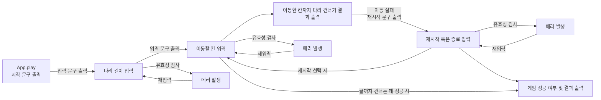

# 다리 건너기 기능 목록

## 기능 구현 목록

- [x] 🖨 게임 시작 문구를 출력합니다.
- [x] ⌨ readBridgeSize 메서드를 통해 다리 길이를 입력받습니다.
  - [x] 💥 다리 길이에 대해 예외인경우 에러를 발생시킵니다.
    - 빈 칸이 입력되었을 경우
    - 숫자가 아닐 경우
    - 3 이상 20 이하가 아닌 경우
    - 정수가 아닌 경우
- [x] BridgeMaker 클래스를 이용해 다리를 생성합니다.
  - [x] BridgeRandomNumberGenerator를 통해 무작위로 1 혹은 0을 뽑아줍니다.
    - [x] 무작위 값이 0인 경우 아래 칸을 건널 수 있습니다.
    - [x] 무작위 값이 1인 경우 위 칸을 건널 수 있습니다.
  - [x] 위 칸을 건널 수 있는 경우 U, 아래 칸을 건널 수 있는 경우 D값으로 배열을 생성하고, 반환합니다.
- [x] ⌨ readMoving 메서드를 통해 이동할 칸을 입력받습니다.
  - [x] 위 칸으로 이동할 경우 대문자 U를 입력받습니다.
  - [x] 아래 칸으로 이동할 경우 대문자 D를 입력받습니다.
  - [x] 💥 대문자 U와 D가 아닌 값이 입력된 경우 예외를 발생시킵니다.
    - 빈 칸이 입력되었을 경우
    - U와 D가 아닌 경우
    - 소문자도 예외 발생
- [x] 칸을 이동합니다.
  - [x] 이동한 칸을 건널 수 있다면 O로 표시합니다.
  - [x] 이동한 칸을 건널 수 없다면 X로 표시합니다.
  - [x] 선택하지 않은 칸은 공백 한 칸으로 표시합니다.
  - [x] 다리의 시작과 끝은 '['과 ']'으로 표시합니다.
  - [x] 칸의 구분은 '|' 로 표시합니다.
- [x] 🖨 이동한 칸을 출력합니다.
  - [x] 현재까지 건넌 다리를 모두 출력합니다.
- [x] 다리를 끝까지 건너면 게임이 종료됩니다.
- [x] ⌨ 다리를 건너다 실패하면 readGameCommand 메서드를 통해 게임 진행 옵션을 입력받습니다.
  - [x] 대문자 R을 입력받았다면, 게임을 다시 시도합니다.
    - [x] 이 경우, 초기 생성된 다리로 게임을 시작합니다.
  - [x] 대문자 Q를 입력받았다면, 게임을 종료합니다.
  - [x] 💥 대문자 R와 Q가 아닌 값이 입력된 경우 예외를 발생시킵니다.
    - 빈 칸이 입력되었을 경우
    - R와 Q가 아닌 경우
    - 소문자도 예외 발생
- [x] 🖨 게임이 종료되면 최종 결과를 출력합니다.
  - [x] 🖨 게임 성공 여부를 출력합니다.
    - [x] 다리를 끝까지 건넌 경우 성공을 출력합니다.
    - [x] 다리를 건너지 못한 경우 실패를 출력합니다.
  - [x] 🖨 총 시도한 횟수를 출력합니다.
    - [x] 첫 시도를 포함해 게임을 종료할 때까지 시도한 횟수를 나타냅니다.

## 예외 처리 사항

- [x] 💥 사용자가 잘못된 값을 입력한 경우 throw문을 사용해 예외를 발생시킵니다.
  - [x] 🖨 "[ERROR]"로 시작하는 에러 메시지를 출력합니다.
  - [x] 에러 메세지 출력 후 에러 발생 부분부터 다시 입력을 받습니다.

# 클래스 및 객체 기능 목록

- InputView 객체
  - 사용자의 값 입력 받는 기능을 수행합니다.
  - App 클래스의 play 메서드로 실행됩니다.
  
  - readBridgeSize
    - 다리 길이를 입력받습니다.
    - ValidateBridgeSize 클래스를 통해 입력값의 유효성을 판단하고, 에러를 발생합니다.
      - 만약 에러가 발생되었다면, 에러 문구를 출력하고 readBridgeSize 메서드를 호출합니다.
    - UseGameInfo 클래스의 createBridge 메서드를 호출합니다.
    - UseGameInfo 클래스의 initializeGameInfo 메서드를 호출합니다.

  - readMoving
    - 이동할 칸을 입력받습니다.
    - ValidateMoving 클래스를 통해 입력값의 유효성을 판단하고, 에러를 발생합니다.
      - 만약 에러가 발생되었다면, 에러 문구를 출력하고 readMoving 메서드를 호출합니다.
  
  - moveBridge
    - 다리를 이동하기 위해 BridgeGame 클래스의 move메서드를 호출합니다.
    - 현재 진행 상황을 출력하기 위해 OutputView 객체의 printMap을 호출합니다.
    - 만약, 다리를 건너는 데 실패했다면, readGameCommand 메서드를 호출합니다.
    - 다리를 건너는 데 실패하지는 않았지만, 아직 게임 도중이라면, readMoving 메서드를 호출합니다.
    - 다리를 건너는 데 성공했다면, OutputView 메서드의 printSuccess 메서드를 호출합니다.

  - readGameCommand
    - 재시작 여부를 입력받습니다.
    - ValidateGameCommand 클래스를 통해 입력값의 유효성을 판단하고, 에러를 발생합니다.
      - 만약 에러가 발생되었다면, 에러 문구를 출력하고 readGameCommand 메서드를 호출합니다.
    - BridgeGame 클래스의 retry 메서드 반환값에 따라 playGame을 호출하거나 OutputView 객체의 printResult 메서드를 호출합니다.
      - retry 메서드가 true라면, UseGameInfo 클래스의 initializeGameInfo 메서드가 호출됩니다.

- OutputView 객체
  - printMessage
    - 인자로 받은 메세지를 출력합니다.

  - printMap
    - 현재 진행중인 게임의 다리 상황을 출력합니다.

  - printSuccess
    - "성공"을 출력하기 위해 GameInfo객체의 gameResult 프로퍼티 값을 "성공"으로 변경합니다.
    - printResult 메서드를 호출합니다.

  - printResult
    - 최종 게임 결과를 출력합니다.

- BridgeGame 클래스
  - move
    - 위치를 1 증가시킵니다.
    - 현재 입력받은 이동할 칸을 gameStat에 담아줍니다.
    - moveBridge를 호출합니다.

  - recordCurrentStatus
    - isValidMove 메서드의 반환값에 따라 pushMoveBridge 메서드의 입력값을 다르게 호출합니다.

  - retry
    - 재시작 여부 입력값에 따라 true 혹은 false를 반환합니다.

- Validate (BridgeSize, GameCommand, Moving) 클래스
  - 입력값이 유효한지 판단하고, 유효하지 않다면 에러를 발생합니다.

- GameInfo 객체
  - 다리 건너기 게임에 대한 정보들을 포함합니다.

  - gameStat
    - 현재까지 이동한 칸의 값의 배열을 가집니다.

  - bridgeSize
    - 입력받은 다리 길이의 값을 가집니다.
  
  - bridge
    - BridgeMaker 클래스로 생성된 다리 배열을 가집니다.

  - indexingArray
    - "U", "D"가 입력값으로 들어올 때, 인덱스를 찾아주기 위해 저장해놓은 값입니다.

  - moveBridge
    - 위 칸과 아래 칸을 저장할 2차원 배열을 가집니다.

  - position
    - 현재 위치의 인덱스를 가집니다. 초기값은 -1입니다.

  - moving
    - 현재 입력받은 이동할 칸을 값으로 가집니다.

  - numberOfPlayGames
    - 현재 총 시도한 판 수를 값으로 가집니다.

  - gameResult
    - 현재 게임 성공 여부를 값으로 가집니다.
    - 초기 값은 "실패"이며, 게임 클리어 시 "성공" 값을 가지게 됩니다.

- InputErrorProcess
  - try - catch문 사용으로 try문 내부에서 에러가 발생할 경우, catch문을 수행하게 합니다.

- UseGameInfo
  - GameInfo 객체를 사용하는 메서드들이 담겨있습니다.

  - initializeGameInfo
    - GameInfo 객체의 값들을 게임의 시작 상태로 초기화합니다.
    - 단, numberOfPlayGames 프로퍼티는 1 증가시켜줍니다.

  - isLastTurn
    - 다리 건너기 게임에서 마지막 턴인지 확인합니다.

  - isFailure
    - 만약 현재 상태에서 "X"가 존재한다면, true를 반환합니다.

  - isValidMove
    - 현재 입력받은 이동할 칸과 같은 위치의 생성된 다리 배열의 값이 같은지 확인합니다. 

  - pushMoveBridge
    - moveBridge는 두 개의 1차원 배열을 가지는 2차원 배열입니다. 이 배열의 인덱스에 알맞게 값을 넣어줍니다.
    - 인덱스가 [0, 1]로 구성되어 있어, indexOf 메서드를 통해 1이 나온다면, (1 + 1) % 2 ==> 0을 해주어 인덱스를 맞춰줍니다

  - createBridge
    - BridgeMaker를 통해 다리를 생성합니다.

# 테스트

- ApplicationTest
  - 다리 건너기 테스트
    - 다리 생성 테스트
    - 기능 테스트
    - 재시작 테스트
    - 실패 후 종료 테스트

  - 예외 발생 테스트
    - 다리 길이 입력 예외 발생 후 다시 입력 받는 기능 테스트
    - 이동할 칸 입력시 예외 발생 후 다시 입력 받는 기능 테스트
    - 재시작 여부 입력 예외 발생 후 다시 입력 받는 기능 테스트

- ValidateTest
  - ValidateBridgeSize 클래스 테스트
    - 다리 길이 입력값이 숫자가 아닌 경우 예외가 발생합니다.
    - 다리 길이 입력값이 음수인 경우 예외가 발생합니다.
    - 다리 길이 입력값이 자연수가 아닌 경우 예외가 발생합니다.
    - 다리 길이 입력값이 3 이상 20 이하의 수가 아닌 경우 예외가 발생합니다.
    - 다리 길이 입력값에 공백이 포함되는 경우 예외가 발생합니다.

  - ValidateMoving 클래스 테스트
    - 이동할 칸 입력값이 알파벳 문자가 아닌 경우 예외가 발생합니다.
    - 이동할 칸 입력값이 소문자인 경우 예외가 발생합니다.
    - 이동할 칸 입력값이 대문자이지만 'U' 혹은 'D'가 아닐 경우 예외가 발생합니다.
    - 이동할 칸 입력값이 'U' 혹은 'D'지만, 입력값의 길이가 1이 아닐 경우 예외가 발생합니다.

  - ValidateGameCommand 클래스 테스트
    - 재시작 여부 입력값이 알파벳 문자가 아닌 경우 예외가 발생합니다.
    - 재시작 여부 입력값이 알파벳 소문자인 경우 예외가 발생합니다.
    - 재시작 여부 입력값이 알파벳 대문자이지만 'R' 혹은 'Q'가 아닐 경우 예외가 발생합니다.
    - 재시작 여부 입력값이 알파벳 대문자 'R' 혹은 'Q'지만, 입력값의 길이가 1이 아닐 경우 예외가 발생합니다.


# 과정

## 과정 설계



## 기능 나열

- 다리 길이 입력 문구 출력 및 입력을 받습니다.
- 이동할 칸 입력 문구 출력 및 입력을 받습니다.
- 현재 다리 상황 출력합니다.
- 다리 건너는 도중 실패하면 재시작 문구 출력 및 입력을 받습니다.
- 성공 시 종료합니다.
- 최종 게임 결과를 출력합니다.

각 과정에서 필요한 기능을 추가합니다.

- 다리 길이 입력 문구 출력 및 입력을 받습니다.
  - 입력값만큼의 길이를 가진 다리를 생성합니다.
- 이동할 칸 입력 문구 출력 및 입력을 받습니다.
  - 성공 혹은 실패할 때 까지 무한 반복합니다.
- 현재 다리 상황 출력합니다.
  - 성공 혹은 실패할 때 까지 무한 반복합니다.
- 다리 건너는 도중 실패하면 재시작 문구 출력 및 입력을 받습니다.
  - 재시작 입력시, 다시 첫 이동부터 입력을 받습니다. (총 시도 횟수는 증가합니다)
  - 종료 입력시, 최종 결과를 출력합니다.
- 성공 시 종료합니다.
- 최종 게임 결과를 출력합니다.
  - 총 시도 횟수와 게임 결과를 이용해 출력합니다.

## 예외 사항

입력값을 받는 경우에 대한 예외처리가 필요합니다.

- 다리 길이 입력
- 이동할 칸 입력
- 재시작 여부 입력

입력에 대한 조건을 추가했습니다.

- 다리 길이 입력
  - 입력값은 숫자입니다.
  - 입력값은 3 이상 20 이하인 자연수입니다.

- 이동할 칸 입력
  - 입력값은 문자입니다.
  - 입력값은 "U" 이거나 "D" 여야만 합니다.

- 재시작 여부 입력
  - 입력값은 문자입니다.
  - 입력값은 "Q"이거나 "R" 여야만 합니다.

- 이 3개의 입력받는 기능에 대해서 클래스로 분리합니다.
- 각각의 클래스는 입력값을 받아 유효성을 검사하고 다시 반환합니다.
- 각각 받은 입력값에 대해 getter와 setter를 적용해 프로퍼티 값을 통제합니다.

# 리펙토링

- 중복되는 기능을 가진 메소드 통합

- 반복적인 작업을 수행하는 테스트 케이스 코드 수정

- 상수 사용으로 인한 코드 리펙토링

- try-catch문을 통합한 메서드 inputErrorProcess 생성 및 코드 수정

- InputErrorProcess 클래스 생성 및 코드 분리

- UseGameInfo 클래스 생성으로 인한 코드 분리

- 용도에 따른 디렉토리 구조 변경

```
-- src
  |  
  |-App.js
  |
  |-- constants
  |   |
  |   |-constant.js
  |
  |-- domain
  |   |
  |   |-BridgeGame.js
  |   |-BridgeMaker.js
  |   |-BridgeRandomNumberGenerator.js
  |   |-GameInfo.js
  |   |-InputErrorProcess.js
  |   |-UseGameInfo.js
  |
  |-- ui
  |   |
  |   |-InputView.js
  |   |-OutputView.js
  |
  |-- utils
  |   |
  |   |-ValidateBridgeSize.js
  |   |-ValidateGameCommand.js
  |   |-ValidateMoving.js
  |
```

